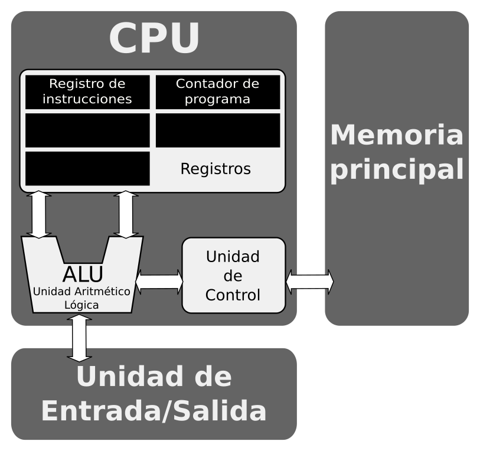

# Resultados de aprendizaje y criterios de evaluación

- **RA1** Reconoce los elementos y herramientas que intervienen en el desarrollo de un programa informático, analizando sus características y las fases en las que actúan hasta llegar a su puesta en funcionamiento.
  - **CE.a** Se ha reconocido la relación de los programas con los componentes del sistema informático: memoria, procesador y periféricos, entre otros.

# El ordenador: una máquina programable

Es bien conocido que el ordenador se compone de dos partes bien diferenciadas: **software** y **hardware**.

> Se da por sentado que se conoce la diferencia entre software y hardware.

En este módulo nos vamos a centrar en la parte del software, al final estás cursando un ciclo de programación, pero no podemos obviar el hardware en tanto que lo que vas a aprender a programar es una máquina, es el hardware. Así, voy a empezar por explicarte qué es un ordenador, a nivel de hardware, y lo voy a hacer entrando en la arquitectura de los ordenadores actuales.

# Arquitectura von Neumann

Una arquitectura de ordenador es un modelo y una descripción del funcionamiento del mismo. Especial es el papel que juega en esta descripción la forma en la que la Unidad Central de Proceso (CPU, del inglés Central Processing Unit) trabaja internamente y accede a las direcciones de memoria.

La arquiectura von Neumman es una arquitectura de ordenador basada en la descrita en 1945 por el matemático y físico John von Neumann. Esta arquitectura describe un ordenador con tres partes: unidad de procesamiento, memoria principal y unidad de entrada/salida:

En los siguientes apartados detallamos cada una de estas partes de la arquitectura.

## Unidad de procesamiento

Conocida como **CPU** (Centra Procesing Unit), procesador o microprocesador, se encarga de todas las operaciones y el control del ordenador. Es la CPU lo que, en última instancia, estamos programando.

En la CPU encontramos una **Unidad Aritmético Lógica** (ALU), una serie de **registros** y una **Unidad de Control** que te describo brevemente a continuación:

- Una **Unidad Aritmético Lógica**, o **ALU** del inglés *Arithmetic Logic Unit*, es un circuito digital que realiza operaciones aritméticas (sumas, restas) y operaciones lógicas (IF, AND, OR, NOT, XOR) entre los valores de los argumentos (que pueden ser uno o dos, según el caso). Se representa, gráficamente, tal que así:

> Si sientes curiosidad puedes visitar este sitio web donde encontrarás [detalles de cómo funciona una ALU](https://hardzone.es/reportajes/que-es/alu/).

- Una serie de **registros** que forman la memoria más rápida de la jerarquía de memoria de un ordenador. Se encuentran dentro de la CPU, y se usan para almacenar operandos y resultados de las operaciones que hace la CPU. Los registros se miden por el número de bits que almacenan, por ejemplo: un registro de 8 bits, o un registros de 32 bits, o un registro de 64 bits. Dependiendo de la arquitectura se tienen más o menos registros de más o menos bits.

> Investiga: ¿qué tamaño tienen los registros de las CPU actuales?, ¿cuántos registro tiene un microprocesador actual?, ¿de qué orden de magnitod es más rápido un registro con respecto a la memoria principal?

- Una **Unidad de Control** que manda señales al resto de componentes para que todas las partes estén sincronizadas. Se comporta como los semáforos que regulan el tráfico en los cruces dejando actuar a unos y deteniendo a otros. Además, esta Unidad de Control usa una serie de registros especiales como son: un ***registro de instrucciones** (o RI) donde se almacena la instrucción que se está ejecutando y un **contador de programa** (o PC) donde se almacena la dirección de la memoria donde está la instrucción que se está ejecutando.

## Memoria principal

Esta es la memoria del ordenador que nosotros solemos conocer coloquialmente como "memoria RAM". En esta memoria se almacenan los programas, es decir, todas las instrucciones de todos los programas que se están ejecutando en un ordenador, más los datos.

> No confundas memoria principal con memoria secundaria. La memoria principal forma parte de la aquitectura y es una memoria muy rápida. La memoria secundaria es un dispositivo como un disco duro, un disco sólido, un dispositivo de almacenamiento USB, un DVD, etc. Esta memoria secundaria es un periférico y es donde tenemos almacenados los datos y programas instalados.

> Se presupone que conoces la diferencia entre memoria principal y secundaria. Si no es así deberías [leer este artículo](https://www.geeksforgeeks.org/difference-between-primary-and-secondary-memory/).

## Unidad de Entrada/Salida

La **unidad de entrada/saslida**, o simplemente unidad de E/S, es el mecanismo que permite conectar al ordenador todo tipo de periféricos para ampliar las opciones de un ordenador. Por ejemplo, una impresora, un ratón o un teclado es conectado a este mecanismo.

# Tarea propuesta

Haz un esquema de lo estudiado hasta ahora.
