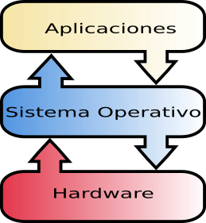

# Resultados de aprendizaje y criterios de evaluación

- **RA1** Reconoce los elementos y herramientas que intervienen en el desarrollo de un programa informático, analizando sus características y las fases en las que actúan hasta llegar a su puesta en funcionamiento.
  - **CE.a** Se ha reconocido la relación de los programas con los componentes del sistema informático: memoria, procesador y periféricos, entre otros.

# Relación software-hardware

Un ordenador consta de un buen número de elementos hardware, y su programación es compleja. En este ciclo vas a aprender a crear software de aplicación, en concreto aplicaciones multiplataformas. Así pues, no vas a programar el ordenador directamente.

Como ves en el siguiente gráfico, solo el sistema operativo (que es un software de sistema) accede directamente al hardware. El resto de aplicaciones se programan sobre el sistema operativo.

# Sistemas operativos

En el mundo de los ordenadores personales hay tres sistemas operativos más o menos populares, que seguramente ya conocerás: Windows, MacOS y Linux.

En el ámbito de los dispositivos móviles se tiene dos plataformas populares: Android y iOS.

El sistema operativo es, en realidad, un conjunto de programas de sistema que gestiona los recursos hardware y provee servicios (una interfaz) a los programas de aplicación. Resumiendo, sus funciones principales son:

- **Gestionar la memoria** de acceso aleatorio y ejecutar las aplicaciones, designando los recursos necesarios.
- **Administrar la CPU** gracias a un algoritmo de programación.
- Direccionar las **entradas y salidas** de datos (a través de drivers) por medio de los periféricos de entrada o salida.
- **Administrar la información** para el buen funcionamiento del PC.
- Dirigir las autorizaciones de uso para los **usuarios**.

# Aplicaciones

Las aplicaciones son **programas de usuario** y son escritas por medio de **lenguajes de programación**.

Tradicionalmente, y todavía hoy en muchos contextos, los programas se escriben para un sistema operativo concreto, lo que hace tedioso disponer del mismo programa para varios sistemas operativos, y no digamos ya para diferentes plataformas: web, móvil, Escritorio, etc.

> Normalmente, si quieres escribir un programa para Web y para móvil, por ejemplo, en realidad tendrás que escribir dos programas, a menos que uses tecnologías multiplataformas.

Esto ha hecho que, en el mundo del desarrollo del software, hayan aparecido diferentes herramientas para la creación de programas multiplataformas, es decir: escribir un programa que funciones para varios sistemas operativos y/o plataformas diferentes.

Independientemente de esto, hay multitud de lenguajes de programación pero todos, hoy en día, tienen una característica en común: usan un léxico, sintaxis y semántica fácil de aprender y usar por el ser humano. Las sentencias de un lenguaje de programación tienen que ser traducidas a un lenguaje o códigos que la máquina pueda interpretar y ejecutar.

Como sabes, una máquina como el ordenador solo es capaz de interpretar señales eléctricas (ausencia o presencia de tensión) que, nosotros interpretamos como 0 (no hay tensión o corriente) y 1 (hay tensión o corriente). A esta codificación la conocemos como binario.

En los siguientes apartados vamos a entrar de lleno en los lenguajes de programación, podrás ver que hay varios tipos de lenguajes de programación y de qué forma se pueden traducir las sentencias de alto nivel a código máquina.

# Investiga

¿Se puede escribir un único programa que pueda ser ejecutado en Android e iOS?
