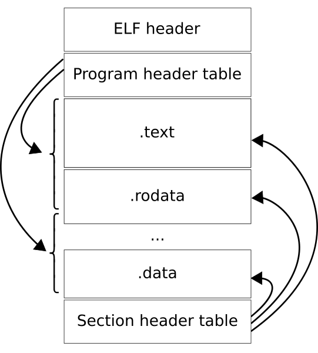
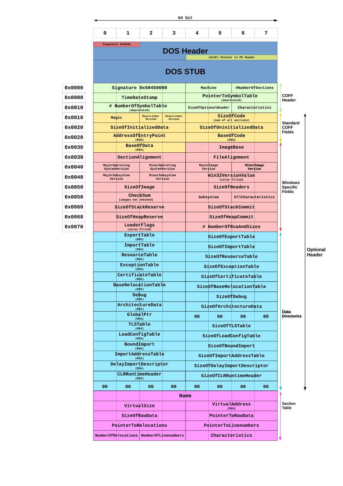

# Resultados de aprendizaje y criterios de evaluación

- **RA1** Reconoce los elementos y herramientas que intervienen en el desarrollo de un programa informático, analizando sus características y las fases en las que actúan hasta llegar a su puesta en funcionamiento.
  - **CE1c** Se han diferenciado los conceptos de código fuente, código objeto y código ejecutable.

# Código fuente, objeto y ejecutable

Hoy en día no se escribe código máquina directamente, así que se necesita de algún mecanismo o forma de obtener dicho código máquina que pueda ejecutar el ordenador.

Antes tienes que saber que existen tres tipos de código: código **fuente**, código **objeto** y código  ***máquina** o ejecutable.

## Código fuente

Se trata de los ficheros con el **código escrito en alto nivel** del lenguaje de programación escogido para la programación. También se denomina código fuente a los programas escritos en **ensamblador**.

Un programa puede estar escrito en uno o varios ficheros.

A continuación te muestro el código fuente de un programa escrito en C y su equivalente en ensamblador. Se trata de un programa que suma dos números y muestra el resultado por pantalla.

```c
#include <stdio.h>

int main(int argc, char **argv)
{
    int num1, num2, resultado;

    num1 = 15;
    num2 = 20;

    resultado = num1 + num2;

    printf("Resultado de sumar %d y %d = %d\n", num1, num2, resultado);

    return 0;
}
```

```asm
    .file   "main.c"
    .text
    .section    .rodata
    .align 8
.LC0:
    .string "Resultado de sumar %d y %d = %d\n"
    .text
    .globl  main
    .type   main, @function
main:
.LFB0:
    .cfi_startproc
    pushq   %rbp
    .cfi_def_cfa_offset 16
    .cfi_offset 6, -16
    movq    %rsp, %rbp
    .cfi_def_cfa_register 6
    subq    $32, %rsp
    movl    %edi, -20(%rbp)
    movq    %rsi, -32(%rbp)
    movl    $15, -4(%rbp)
    movl    $20, -8(%rbp)
    movl    -4(%rbp), %edx
    movl    -8(%rbp), %eax
    addl    %edx, %eax
    movl    %eax, -12(%rbp)
    movl    -12(%rbp), %ecx
    movl    -8(%rbp), %edx
    movl    -4(%rbp), %eax
    movl    %eax, %esi
    leaq    .LC0(%rip), %rdi
    movl    $0, %eax
    call    printf@PLT
    movl    $0, %eax
    leave
    .cfi_def_cfa 7, 8
    ret
    .cfi_endproc
.LFE0:
    .size   main, .-main
    .ident  "GCC: (Debian 10.2.1-6) 10.2.1 20210110"
    .section        .note.GNU-stack,"",@progbits
```

## Código objeto

Es el **código binario resultante de traducir cada fichero fuente**. Este código no es inteligible por el ser humano pero tampoco está listo para ser ejecutado por la CPU.

Aquí te muestro el código *desensamblado* en hexadecimal, donde se indican las direcciones de la memoria virtual donde se cargará el programa y las instrucciones, también en hexadecimal.

Por cuestiones de claridad, a la derecha tienes el código ensamblador equivalente.

```asm
0000000000000000 <main>:
0:  55                      push   %rbp
1:  48 89 e5                mov    %rsp,%rbp
4:  48 83 ec 20             sub    $0x20,%rsp
8:  89 7d ec                mov    %edi,-0x14(%rbp)
b:  48 89 75 e0             mov    %rsi,-0x20(%rbp)
f:  c7 45 fc 0f 00 00 00    movl   $0xf,-0x4(%rbp)
16: c7 45 f8 14 00 00 00    movl   $0x14,-0x8(%rbp)
1d: 8b 55 fc                mov    -0x4(%rbp),%edx
20: 8b 45 f8                mov    -0x8(%rbp),%eax
23: 01 d0                   add    %edx,%eax
25: 89 45 f4                mov    %eax,-0xc(%rbp)
28: 8b 4d f4                mov    -0xc(%rbp),%ecx
2b: 8b 55 f8                mov    -0x8(%rbp),%edx
2e: 8b 45 fc                mov    -0x4(%rbp),%eax
31: 89 c6                   mov    %eax,%esi
33: 48 8d 3d 00 00 00 00    lea    0x0(%rip),%rdi        # 3a <main+0x3a>
3a: b8 00 00 00 00          mov    $0x0,%eax
3f: e8 00 00 00 00          callq  44 <main+0x44>
44: b8 00 00 00 00          mov    $0x0,%eax
49: c9                      leaveq
4a: c3                      retq
```

Este código, aunque está ya en binario, no está listo para ser cargado en memoria y empezar su ejecución, falta un paso más, su adaptación a código máquina.

## Código máquina

También llamado código ejecutable, es el código binario resultante de enlazar los archivos con el código objeto y ciertas rutinas y bibliotecas necesarias.

Siguiendo con el ejemplo anterior, aquí te muestro el código ejecutable desensamblado. Como ves es bastante más largo que el código objeto anterior porque se han añadido ciertas rutinas y bibliotecas necesarias, todo en un mismo fichero.

Por cuestiones de claridad, aquí también te muestro a la derecha el código ensamblador equivalente.

```asm
0000000000001000 <_init>:
    1000:   48 83 ec 08             sub    $0x8,%rsp
    1004:   48 8b 05 dd 2f 00 00    mov    0x2fdd(%rip),%rax        # 3fe8 <__gmon_start__>
    100b:   48 85 c0                test   %rax,%rax
    100e:   74 02                   je     1012 <_init+0x12>
    1010:   ff d0                   callq  *%rax
    1012:   48 83 c4 08             add    $0x8,%rsp
    1016:   c3                      retq

Desensamblado de la sección .plt:

0000000000001020 <.plt>:
    1020:   ff 35 e2 2f 00 00       pushq  0x2fe2(%rip)        # 4008 <_GLOBAL_OFFSET_TABLE_+0x8>
    1026:   ff 25 e4 2f 00 00       jmpq   *0x2fe4(%rip)        # 4010 <_GLOBAL_OFFSET_TABLE_+0x10>
    102c:   0f 1f 40 00             nopl   0x0(%rax)

0000000000001030 <printf@plt>:
    1030:   ff 25 e2 2f 00 00       jmpq   *0x2fe2(%rip)        # 4018 <printf@GLIBC_2.2.5>
    1036:   68 00 00 00 00          pushq  $0x0
    103b:   e9 e0 ff ff ff          jmpq   1020 <.plt>

Desensamblado de la sección .plt.got:

0000000000001040 <__cxa_finalize@plt>:
    1040:   ff 25 b2 2f 00 00       jmpq   *0x2fb2(%rip)        # 3ff8 <__cxa_finalize@GLIBC_2.2.5>
    1046:   66 90                   xchg   %ax,%ax

Desensamblado de la sección .text:

0000000000001050 <_start>:
    1050:   31 ed                   xor    %ebp,%ebp
    1052:   49 89 d1                mov    %rdx,%r9
    1055:   5e                      pop    %rsi
    1056:   48 89 e2                mov    %rsp,%rdx
    1059:   48 83 e4 f0             and    $0xfffffffffffffff0,%rsp
    105d:   50                      push   %rax
    105e:   54                      push   %rsp
    105f:   4c 8d 05 7a 01 00 00    lea    0x17a(%rip),%r8        # 11e0 <__libc_csu_fini>
    1066:   48 8d 0d 13 01 00 00    lea    0x113(%rip),%rcx        # 1180 <__libc_csu_init>
    106d:   48 8d 3d c1 00 00 00    lea    0xc1(%rip),%rdi        # 1135 <main>
    1074:   ff 15 66 2f 00 00       callq  *0x2f66(%rip)        # 3fe0 <__libc_start_main@GLIBC_2.2.5>
    107a:   f4                      hlt
    107b:   0f 1f 44 00 00          nopl   0x0(%rax,%rax,1)

0000000000001080 <deregister_tm_clones>:
    1080:   48 8d 3d a9 2f 00 00    lea    0x2fa9(%rip),%rdi        # 4030 <__TMC_END__>
    1087:   48 8d 05 a2 2f 00 00    lea    0x2fa2(%rip),%rax        # 4030 <__TMC_END__>
    108e:   48 39 f8                cmp    %rdi,%rax
    1091:   74 15                   je     10a8 <deregister_tm_clones+0x28>
    1093:   48 8b 05 3e 2f 00 00    mov    0x2f3e(%rip),%rax        # 3fd8 <_ITM_deregisterTMCloneTable>
    109a:   48 85 c0                test   %rax,%rax
    109d:   74 09                   je     10a8 <deregister_tm_clones+0x28>
    109f:   ff e0                   jmpq   *%rax
    10a1:   0f 1f 80 00 00 00 00    nopl   0x0(%rax)
    10a8:   c3                      retq
    10a9:   0f 1f 80 00 00 00 00    nopl   0x0(%rax)

00000000000010b0 <register_tm_clones>:
    10b0:   48 8d 3d 79 2f 00 00    lea    0x2f79(%rip),%rdi        # 4030 <__TMC_END__>
    10b7:   48 8d 35 72 2f 00 00    lea    0x2f72(%rip),%rsi        # 4030 <__TMC_END__>
    10be:   48 29 fe                sub    %rdi,%rsi
    10c1:   48 89 f0                mov    %rsi,%rax
    10c4:   48 c1 ee 3f             shr    $0x3f,%rsi
    10c8:   48 c1 f8 03             sar    $0x3,%rax
    10cc:   48 01 c6                add    %rax,%rsi
    10cf:   48 d1 fe                sar    %rsi
    10d2:   74 14                   je     10e8 <register_tm_clones+0x38>
    10d4:   48 8b 05 15 2f 00 00    mov    0x2f15(%rip),%rax        # 3ff0 <_ITM_registerTMCloneTable>
    10db:   48 85 c0                test   %rax,%rax
    10de:   74 08                   je     10e8 <register_tm_clones+0x38>
    10e0:   ff e0                   jmpq   *%rax
    10e2:   66 0f 1f 44 00 00       nopw   0x0(%rax,%rax,1)
    10e8:   c3                      retq
    10e9:   0f 1f 80 00 00 00 00    nopl   0x0(%rax)

00000000000010f0 <__do_global_dtors_aux>:
    10f0:   80 3d 39 2f 00 00 00    cmpb   $0x0,0x2f39(%rip)        # 4030 <__TMC_END__>
    10f7:   75 2f                   jne    1128 <__do_global_dtors_aux+0x38>
    10f9:   55                      push   %rbp
    10fa:   48 83 3d f6 2e 00 00    cmpq   $0x0,0x2ef6(%rip)        # 3ff8 <__cxa_finalize@GLIBC_2.2.5>
    1101:   00
    1102:   48 89 e5                mov    %rsp,%rbp
    1105:   74 0c                   je     1113 <__do_global_dtors_aux+0x23>
    1107:   48 8b 3d 1a 2f 00 00    mov    0x2f1a(%rip),%rdi        # 4028 <__dso_handle>
    110e:   e8 2d ff ff ff          callq  1040 <__cxa_finalize@plt>
    1113:   e8 68 ff ff ff          callq  1080 <deregister_tm_clones>
    1118:   c6 05 11 2f 00 00 01    movb   $0x1,0x2f11(%rip)        # 4030 <__TMC_END__>
    111f:   5d                      pop    %rbp
    1120:   c3                      retq
    1121:   0f 1f 80 00 00 00 00    nopl   0x0(%rax)
    1128:   c3                      retq
    1129:   0f 1f 80 00 00 00 00    nopl   0x0(%rax)

0000000000001130 <frame_dummy>:
    1130:   e9 7b ff ff ff          jmpq   10b0 <register_tm_clones>

0000000000001135 <main>:
    1135:   55                      push   %rbp
    1136:   48 89 e5                mov    %rsp,%rbp
    1139:   48 83 ec 20             sub    $0x20,%rsp
    113d:   89 7d ec                mov    %edi,-0x14(%rbp)
    1140:   48 89 75 e0             mov    %rsi,-0x20(%rbp)
    1144:   c7 45 fc 0f 00 00 00    movl   $0xf,-0x4(%rbp)
    114b:   c7 45 f8 14 00 00 00    movl   $0x14,-0x8(%rbp)
    1152:   8b 55 fc                mov    -0x4(%rbp),%edx
    1155:   8b 45 f8                mov    -0x8(%rbp),%eax
    1158:   01 d0                   add    %edx,%eax
    115a:   89 45 f4                mov    %eax,-0xc(%rbp)
    115d:   8b 4d f4                mov    -0xc(%rbp),%ecx
    1160:   8b 55 f8                mov    -0x8(%rbp),%edx
    1163:   8b 45 fc                mov    -0x4(%rbp),%eax
    1166:   89 c6                   mov    %eax,%esi
    1168:   48 8d 3d 99 0e 00 00    lea    0xe99(%rip),%rdi        # 2008 <_IO_stdin_used+0x8>
    116f:   b8 00 00 00 00          mov    $0x0,%eax
    1174:   e8 b7 fe ff ff          callq  1030 <printf@plt>
    1179:   b8 00 00 00 00          mov    $0x0,%eax
    117e:   c9                      leaveq
    117f:   c3                      retq

0000000000001180 <__libc_csu_init>:
    1180:   41 57                   push   %r15
    1182:   4c 8d 3d 5f 2c 00 00    lea    0x2c5f(%rip),%r15        # 3de8 <__frame_dummy_init_array_entry>
    1189:   41 56                   push   %r14
    118b:   49 89 d6                mov    %rdx,%r14
    118e:   41 55                   push   %r13
    1190:   49 89 f5                mov    %rsi,%r13
    1193:   41 54                   push   %r12
    1195:   41 89 fc                mov    %edi,%r12d
    1198:   55                      push   %rbp
    1199:   48 8d 2d 50 2c 00 00    lea    0x2c50(%rip),%rbp        # 3df0 <__do_global_dtors_aux_fini_array_entry>
    11a0:   53                      push   %rbx
    11a1:   4c 29 fd                sub    %r15,%rbp
    11a4:   48 83 ec 08             sub    $0x8,%rsp
    11a8:   e8 53 fe ff ff          callq  1000 <_init>
    11ad:   48 c1 fd 03             sar    $0x3,%rbp
    11b1:   74 1b                   je     11ce <__libc_csu_init+0x4e>
    11b3:   31 db                   xor    %ebx,%ebx
    11b5:   0f 1f 00                nopl   (%rax)
    11b8:   4c 89 f2                mov    %r14,%rdx
    11bb:   4c 89 ee                mov    %r13,%rsi
    11be:   44 89 e7                mov    %r12d,%edi
    11c1:   41 ff 14 df             callq  *(%r15,%rbx,8)
    11c5:   48 83 c3 01             add    $0x1,%rbx
    11c9:   48 39 dd                cmp    %rbx,%rbp
    11cc:   75 ea                   jne    11b8 <__libc_csu_init+0x38>
    11ce:   48 83 c4 08             add    $0x8,%rsp
    11d2:   5b                      pop    %rbx
    11d3:   5d                      pop    %rbp
    11d4:   41 5c                   pop    %r12
    11d6:   41 5d                   pop    %r13
    11d8:   41 5e                   pop    %r14
    11da:   41 5f                   pop    %r15
    11dc:   c3                      retq
    11dd:   0f 1f 00                nopl   (%rax)

00000000000011e0 <__libc_csu_fini>:
    11e0:   c3                      retq

Desensamblado de la sección .fini:

00000000000011e4 <_fini>:
    11e4:   48 83 ec 08             sub    $0x8,%rsp
    11e8:   48 83 c4 08             add    $0x8,%rsp
    11ec:   c3                      retq
```

# Carga del programa ejecutable

El código ejecutable tiene que tener un formato que entienda el sistema operativo sobre el que se vaya a ejecutar. A continuación, te explico brevemente, los formatos usados en los sistemas operativos Linux y Windows:

- En **Linux** el formato se denomina **ELF** (*Executable and Linkable Format*). Estos ficheros ejecutables tiene una cabecera (*ELF header*), el *.text* donde están las instrucciones del programa y el *.data* donde están los datos del mismo (entre otras cosas). En la [Wikipedia](https://en.wikipedia.org/wiki/Executable_and_Linkable_Format) puedes ver los detalles de estos ejecutables.



- En **Windows** el formato se denomina **EXE** (de *EXEcutable*) y que, internamente, se conoce como **PE** (*Portable Executable*). Estos ficheros tienen, también, una cabecera (*DOS header*) y una serie de punteros (que se pueden ver debajo en la siguiente imagen) a las instrucciones y los datos del programa. En la propia [web de Microsoft](https://learn.microsoft.com/en-us/windows/win32/debug/pe-format#coff-file-header-object-and-image) puedes leer los detalles de los *Portable Executable* para los programas de 32 bits.



Por ese motivo, un **programa escrito y convertido para ser ejecutado en Linux no puede ser ejecutado en Windows, y viceversa**.
