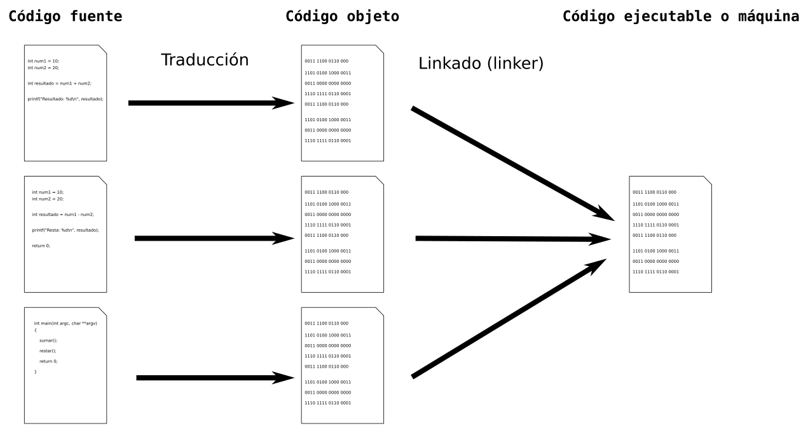

# Resultados de aprendizaje y criterios de evaluación

- **RA1** Reconoce los elementos y herramientas que intervienen en el desarrollo de un programa informático, analizando sus características y las fases en las que actúan hasta llegar a su puesta en funcionamiento.
  - **CE1d** Se han reconocido las características de la generación de código intermedio para su ejecución en máquinas virtuales.
  - **CE1f** Se ha evaluado la funcionalidad ofrecida por las herramientas utilizadas en programación.

# Traductores de código

Existen dos tipos de lenguajes de programación en cuanto a la forma de obtener el código máquina o ejecutable: **lenguajes interpretados y lenguajes compilados**.

En los lenguajes interpretados, el programa traductor se llama **intérprete** y es el encargado de ir traduciendo el programa a medida que sea necesario, típicamente instrucción a instrucción, y normalmente no guardan el resultado de esa traducción.

En los lenguajes compilados, el programa traductor se llama **compilador** y traduce todo el programa a lenguaje máquina generando un segundo fichero con dicha traducción.

Sea interpretado o compilado el programa es ejecutado por medio del sistema operativo y, dicho código, está preparado para ser ejecutado en una arquitectura de CPU concreta (x86-32, x86-64, MIPS, ARM, etc). Este es el encargado de cargar el programa ejecutable en memoria y gestionar su ejecución por medio de una serie de algoritmos de gestión de procesos.

Por último, cabe mencionar que existen lenguajes con compilación **JIT (Just-in-Time)** que están a medio camino entre lenguaje compilado e interpretado.

> Ejemplos de lenguajes interpretados son: **Python** o **PHP**. Ejemplos de lenguajes compilados son: **C** o **C++**. Por último, ejemplos de lenguajes con compilación JIT son **Java**, **C#** o **Kotlin**.

## Características de los lenguajes compilados

Los lenguajes compilados usan un programa traductor llamado compilador, como ya he comentado, y **generan código nativo**.

Suelen ser más rápidos que los lenguajes interpretados pero tienen dos desventajas: necesitan tiempo extra necesario para completar la compilación antes de poder ejecutar el programa; y dependen de la plataforma del código binario generado.

## Características de los lenguajes interpretados

Dado que el código lo ejecutan los propios intérpretes, el código en sí es independiente de la plataforma.

La desventaja más notable es la velocidad de ejecución comparada con los lenguajes compilados a código nativo.

## Características de la compilación justo a tiempo o JIT

Mezcla entre compilación e interpretación. En lugar de compilar todo el programa antes de ejecutarse (como en los lenguajes compilados), o interpretarlo línea por línea (como en los lenguajes interpretados), un compilador JIT compila ciertas porciones del código en tiempo de ejecución, justo antes de que se necesiten.

Las desventajas de estos lenguajes son, básicamente dos: hay una sobrecarga por la compilación en tiempo de ejecución; y el rendimiento puede variar según cómo se implementa el JIT.

## En resumen

<table>
<thead>
  <tr>
    <th>&nbsp;</th>
    <th>Compiladores</th>
    <th>Intérpretes</th>
    <th>Traductores Just-in-Time (JIT)</th>
  </tr>
</thead>
<tbody>
  <tr>
    <td>
      Ventajas
    </td>
    <td>
      Mayor rendimiento en la ejecución porque el código ya está en lenguaje máquina.<br>
      Una vez compilado, no es necesario recompilar mientras no cambie el código fuente.
    </td>
    <td>
      El código es multiplataforma (mientras haya un intérprete disponible para cada sistema operativo).<br>
      Cambios en el código se pueden probar de inmediato sin recompilación.
    </td>
    <td>
      Combina la flexibilidad de los lenguajes interpretados con el rendimiento de los lenguajes compilados.<br>
      La optimización en tiempo de ejecución permite mejorar el rendimiento, ya que el compilador JIT puede aplicar optimizaciones según el comportamiento real del programa.
    </td>
  </tr>

  <tr>
    <td>
      Desventajas
    </td>
    <td>
      El proceso de compilación puede ser lento y es necesario recompilar si hay cambios en el código.<br>
      Dependencia de la plataforma: el ejecutable generado normalmente es específico para un sistema operativo o arquitectura.
    </td>
    <td>
      La ejecución es más lenta en comparación con los lenguajes compilados, ya que se traduce y ejecuta el código línea por línea en tiempo de ejecución.
    </td>
    <td>
      Aún hay una sobrecarga por la compilación en tiempo de ejecución.<br>
      El rendimiento puede variar según cómo se implementa el JIT.
    </td>
  </tr>
</tbody>
</table>

# Compiladores: proceso de traducción

Vamos a centrarnos en los compiladores y el proceso de traducción de estos.

Todo comienza cuando **el programador escribe el código fuente**, normalmente en varios ficheros.

A continuación, **se ejecuta el compilador sobre dichos ficheros generando el código objeto** y dando como resultado los mismos ficheros pero con dicho código objeto. Esta traducción solo se realiza si no hay errores léxicos, sintáctico y/o semánticos en el código fuente escrito por el programador. Si hay errores en el código, el compilador avisa al programador de dichos errores.

Una vez se tienen los ficheros objeto, **un programa llamado linker** enlaza todos los ficheros con el código objeto y bibliotecas generando un solo fichero con el **código máquina o ejecutable**. El programa linker forma parte del compilador y, si no se indica lo contrario, el compilador generará el código objeto y ejecuta, a continuación, el linker automáticamente, sin que tengas que hacer nada extra.

Este proceso se resumen en la siguiente imagen:



> El compilador genera el código ejecutable para una CPU y sistema operativo concreto. Si quieres tener el programa listo para ser ejecutado en CPU MIPS, x86-64 y ARM, entonces tienes que compilar el programa 3 veces, para obtener el código ejecutable en cada una de estas tres arquitecturas.

# Código intermedio y máquinas virtuales

Como ya se ha comentado, el código ejecutable o máquina está listo para ser ejecutado por un tipo de CPU concreta. Esto puede ser un inconveniente si se desea escribir un programa para varias arquitecturas o sistemas operativos.

Hay lenguajes, como Java, para los que **el compilador genera un código intermedio** genérico que es ejecutado por una máquina virtual. Este código intermedio se denomina **bytecode**.

De esta manera no hace falta compilar el código fuente varias veces para ser ejecutado en varias CPU, se construye un código genérico ejecutable por cualquier máquina. No obstante, **para poder ejecutar estos programas** antes necesitas **instalar la máquina virtual** en tu ordenador.

Siguiendo con el **ejemplo de Java**, este tiene un compilador, **javac**, que genera código intermedio (**bytecode**) para ser ejecutado por la **Java Virtual Machine** o **JVM**.

Si quieres ejecutar en tu ordenador programas en Java, tienes que instalar el **JRE** (**Java Runtime Environment**). Si quieres desarrollar programas en Java, entonces necesitas instalar el **JDK** (**Java Development Kit**), que incluye el JRE.

Esquema de la arquitectura general de un programa en ejecución en una JVM:


Por último, aquí te muestro el código fuente de un programa en Java que suma dos números y muestra el resultado por pantalla:

```java
public class Main {
    public static void main(String[] args) {
        int num1, num2, resultado;

        num1 = 10;
        num2 = 15;

        resultado = num1 + num2;

        System.out.println("Resultado de sumar " + num1 + " y " + num2 + " = " + resultado);
    }
}
```

Y, también, el bytecode:

```asm
public class Main {
    public Main();
        Code:
        0: aload_0
        1: invokespecial #1                  // Method java/lang/Object."<init>":()V
        4: return

    public static void main(java.lang.String[]);
        Code:
        0: bipush        10
        2: istore_1
        3: bipush        15
        5: istore_2
        6: iload_1
        7: iload_2
        8: iadd
        9: istore_3
        10: getstatic     #7                  // Field java/lang/System.out:Ljava/io/PrintStream;
        13: iload_1
        14: iload_2
        15: iload_3
        16: invokedynamic #13,  0             // InvokeDynamic #0:makeConcatWithConstants:(III)Ljava/lang/String;
        21: invokevirtual #17                 // Method java/io/PrintStream.println:(Ljava/lang/String;)V
        24: return
    }
```

# Formatos ejecutables

Es apropiado volver a recordar que cada sistema operativo tiene su formato concreto de fichero ejecutable (programa ejecutable). Puedes volver a leer el apartado anterior si no lo recuerdas.

Los traductores de los lenguajes de alto nivel generan, al final del proceso de traducción, un fichero en el formato correspondiente del sistema operativo en el que se vaya a ejecutar. En Linux **ELF** y en Windows **EXE**, por ejemplo.
