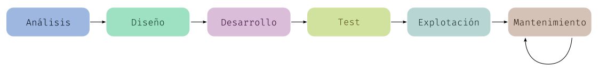

# Resultados de aprendizaje y criterios de evaluación

- **RA1** Reconoce los elementos y herramientas que intervienen en el desarrollo de un programa informático, analizando sus características y las fases en las que actúan hasta llegar a su puesta en funcionamiento.
  - **CE1b** Se han identificado las fases de desarrollo de una aplicación informática.
  - **CE1f** Se ha evaluado la funcionalidad ofrecida por las herramientas utilizadas en programación.

# Ingeniería del software

En la 7ª edición del libro *Ingeniería del software*, de Ian Sommerville, podemos leer que "la ingeniería del software es una disciplina de la ingeniería que comprende todos los aspectos de la producción de software desde las etapas iniciales de la especificación del sistema, hasta el mantenimiento de éste después de que se utiliza".

Pero, claro, aquí surge una pregunta importante: ¿qué es la ingeniería? Tomando la definición de la RAE: "conjunto de conocimientos orientados a la invención y utilización de técnicas para el aprovechamiento de los recursos naturales o para la actividad industrial".

Y, ahora bien, ¿qué hace un ingeniero de software? Básicamente: aplicar conocimientos para producción de software, lo que implica:

- Desarrollo de software.
- Gestión de proyectos de software.
- Desarrollo de herramientas de apoyo a la producción de software.

# ¿Por qué necesitamos de la ingeniería del software?

El software es abstracto e intangible, no está restringido por materiales o gobernado por leyes físicas o por procesos de manufactura. Esto, que simplifica el desarrollo del mismo, hace que sea muy difícil medir los costes asociados a todo el proceso de desarrollo del software.

Según podemos leer en la 7ª edición del libro *Ingeniería del software*, de Ian Sommerville, la noción de ingeniería del software fue propuesta inicialmente en 1968 en una conferencia para discutir lo que en ese entonces se llamó la **crisis del software**. Esta crisis del software fue el resultado de la introducción de las nuevas computadoras hardware basadas en circuitos integrados. Su poder hizo que las aplicaciones hasta ese entonces irrealizables fueran una propuesta factible. El software resultante fue de órdenes de magnitud más grande y màs complejo que los sistemas de software previos.

Hasta ese momento el software se desarrollaba de manera informal pero esta forma de desarrollo pronto se vio que no podía continuar siendo así porque daba lugar a programas muy difíciles de mantener y donde, cada vez más, se producían errores también difíciles de localizar y corregir.

Es en este contexto donde surge el concepto de ingeniería del software y se pone ne marcha.

# Proceso de creación del software

Llamamos proceso del software a las activides necesarias para producir un programa o software. Estas actividades, en general, son:

1. Especificación del software: los clientes definen el software (**análisis**).
2. Desarrollo del software: los desarrolladores diseñan (**diseño**) y escriben el programa (**desarrollo**).
3. Validación del software: los *testers* prueban y comprueban que el software cumple con lo que se desea (**tests** o **pruebas**).
4. Evolución del software: los programas se ponen en producción y a funcionar (**explotación**), y, a partir de ahí, se tienen que mantener a lo largo del tiempo para solucionar errores de todo tipo y añadir nuevas características (**mantenimiento**).

# Fases en el desarrollo de software

## Fase 1: análisis

El objetivo de esta fase es la de alcanzar una comprensión clara del problema que se necesita resolver: **requisitos funcionales**. En estos requisitos funcionales se detalla lo que el sistema debe hacer (acciones, procesos, resutlados esperados). Esto requiere consultar con los clientes o usuarios finales del sistema, lo que hace que esta fase no sea sencilla, ya que:

- El cliente no tiene por qué tener claro los requisitos que debe satisfacer el software a desarrollar.
- Dicho cliente pudiera no describir o expresar del todo bien y claro el sistema a desarrollar.
- Se pueden dar malentendidos como en cualquier conversación entre personas.

A parte de los **requisitos funcionales** hay que tener presetne otros **objetivos no funcionales** que también son muy importantes porque establecen criterios sobre cómo debe comportarse el sistema en cuanto a la usabilidad, fiabilidad, escalabilidad, extensibilidad, seguridad y mantenibilidad:

- **Usabilidad**: cuán fácil es para los usuarios aprender y usar el sistema.
- **Fiabilidad**: que el software funciones sin fallos y, dado, que esto como objetivo es muy difícil de lograr al cien por cien, es importante especificar cómo manejar errores y recuperarse de fallos.
- **Escalabilidad**: capacidad que tiene un sistema de poder aumentar la carga sin disminuir el rendimiento.
- **Extensibilidad**: capacidad de una aplicación para añadir nuevas funcionalidades.
- **Seguridad**: grado de protección de la información y datos que se manejan en la aplicación, así como el control de acceso y protección contra amenzanas externas.
- **Mantenibilidad**: lo que significa que el software se tiene que comprender muy bien para poder ser reparado o mejorado.

Por último, tenemos diferentes técnicas para recopilar la información y para dar soporte a esta primera fase:

- **Entrevistas**: técnica tradicional parecida a una entrevista periodística en al que el analista entrevista, uno a uno, los futuros usuarios del programa.
- **Desarrollo conjunto de aplicaciones** (o JAD, de sus siglas en inglés: *Joint Application Development*): en la que, normalmente, varios analistas y usuarios se reúnen para trabajar conjuntamente en la determinación de las necesidades de los usuarios, lo que promueve la colaboración y reduce malentendidos.
- **Desarrollo de un prototipo**: en la que se construye una maqueta o prototipo que permita a los usuarios finales ver las características del sistema cuanto antes para aclarar requisitos ambiguos y obtener feedback temprano, permitiendo iteraciones antes de comprometerse con el desarrollo completo.

En cualquier caso, al final de esta fase, se obtiene un documento llamado **Especificación de Requisitos del Software** (a partir de ahora ERS) que se usará para la siguiente fase. En estas especificaciones se suelen utilizar ciertos diagramas como pueden ser: **Diagrama de Clases** o **Diagramas de Comportamiento** (**Casos de Uso** o **Diagramas de Interacción**, por ejemplo), entre otros.

> Todos estos diagramas los estudiamos en temas posteriores.

## Fase 2: diseño

La fase de diseño es crucial, ya que en ella **se define cómo se implementarán los requisitos identificados durante el análisis**. El objetivo es transformar la especificación de requisitos en una representación técnica detallada que guiará la fase de desarrollo.

El diseño es la hoja de ruta para la construcción del software. Durante esta fase, se definen la arquitectura general del sistema, los componentes individuales, y cómo se integrarán entre sí. Este plan debe asegurar que el software cumpla con los requisitos tanto funcionales como no funcionales establecidos previamente.

El diseño suele dividirse en dos partes principales:

- **Diseño de Alto Nivel** (Arquitectura de Software): define la estructura global del sistema. Aquí se determina la arquitectura general (por ejemplo, cliente-servidor, microservicios, etc.), los módulos principales, y cómo estos se comunican entre sí.

> Ejemplo: decidir si el sistema tendrá una arquitectura de tres capas (capa de presentación, lógica de negocio y capa de datos) o si se usará una arquitectura de microservicios.

- **Diseño Detallado** (Diseño de Componentes): se enfoca en el diseño específico de cada componente o módulo. Aquí se especifica cómo se implementarán los elementos individuales, cómo interactuarán entre sí, y cómo cumplirán con los requisitos. Esto incluye la definición de clases, funciones, estructuras de datos, y algoritmos.

> Ejemplo: especificar la estructura de clases para un módulo de autenticación, incluyendo detalles como clases de usuario, métodos para gestionar la sesión, y algoritmos de cifrado.

Durante esta fase se elaboran varios diagramas o elementos clave:

- **Diagramas de Arquitectura**: estos diagramas muestran cómo se estructuran e interconectan los módulos principales del sistema. Ejemplos incluyen el Diagrama de Componentes y el Diagrama de Despliegue.

- **Diagramas de Clases** y **de Secuencia**: se suelen utilizar en el diseño detallado para representar la relación entre clases y el flujo de mensajes entre objetos durante la ejecución de casos de uso específicos.

- **Especificación de Interfaces**: define cómo se comunican los diferentes componentes o módulos del sistema. Incluye descripciones de las APIs, protocolos de comunicación y los formatos de datos que se intercambiarán.

- **Definición de Algoritmos** y **Estructuras de Datos**: describe los algoritmos que serán necesarios para la funcionalidad del sistema, así como las estructuras de datos que utilizará cada componente.

Al realizar el diseño se deben considerar varios aspectos para garantizar la calidad del software:

- **Modularidad**: el sistema debe estar dividido en módulos bien definidos, lo que facilita su comprensión y mantenimiento.

- **Reutilización**: siempre que sea posible, se deben reutilizar componentes o módulos ya existentes, lo que puede ahorrar tiempo y recursos.

- **Escalabilidad y Mantenibilidad**: el diseño debe permitir la fácil ampliación de funcionalidades y la adaptación a futuras necesidades.

- **Seguridad y Rendimiento**: se deben integrar medidas de seguridad y optimizaciones de rendimiento desde esta fase, anticipando posibles vulnerabilidades o puntos críticos de eficiencia.

Por último, aunque las pruebas o tests se desarrollarán más tarde, desde el diseño es importante especificar un **plan de pruebas**. El plan de pruebas es un documento que describe el enfoque, los recursos y la programación para las actividades de prueba. Incluye una visión general de los tipos de pruebas que se realizarán (como pruebas unitarias, de integración, de sistema y de aceptación).

## Fase 3: fase de desarrollo o programación

En esta fase, el diseño detallado se convierte en código ejecutable, y el software toma forma a través de la programación. Aquí se siguen las especificaciones y el diseño creado en las fases anteriores.

Los desarrolladores crean el código de cada módulo o componente definido en la fase de diseño. Siguen las directrices de estilo y las mejores prácticas para asegurar que el código sea legible y mantenible según el lenguaje de programación elegido.

Varios aspectos a tener en cuenta cuando se desarrolla software:

- Utilizar las **guías de estilo** del lenguaje de programación elegido que incluye: cómo nombrar variables, funciones, clases, etc; indentación del código; división del código en diferentes ficheros fuente de acuerdo a los criterios de las guías de estilo; etc.

- El código en sí mismo debería ser suficientemente claro pero no siempre será posible y habrá que usar **comentarios** en aquellos casos en que sea necesario.

- Uso de **control de versiones** para manejar los cambios e ir construyendo un histórico de cambios adecuado creando versiones cuando sea necesario.

- Aplicar **refactorización**, lo que implica tener que leer y releer el código buscando mejorar su comprensión y, también, su eficiencia y calidad.

Durante el desarrollo del software se tienen que programar, a su vez, pruebas unitarias y de integración, para validar y verificar que el código que escribimos cumple con los requerimientos establecidos en las fases anteriores. Te recuerdo que el plan de pruebas se elabora en la fase anterior.

## Fase 4: pruebas y validación

Esta fase es esencial para asegurar que el software funciona correctamente, cumple con los requisitos y es de calidad. Aunque en la fase de desarrollo ya se hayan realizado pruebas unitarias y de integración, la fase de pruebas y validación se enfoca en la evaluación del sistema en su totalidad y en la verificación de que todo el software cumple con los objetivos planteados.

En temas posteriores profundizaremos en esta fase, así que, de momento, no entraremos en más detalles.

## Fase 5: despliegue o explotación

En esta fase, el software se implementa en el entorno de producción y se pone a disposición de los usuarios finales. Se enfoca en el lanzamiento y la puesta en marcha del sistema, asegurando que los usuarios puedan acceder y utilizar el software en el entorno real.

Estos son los pasos u objetivos de esta fase:

1. **Instalación y configuración**: se despliega el software en el entorno de producción, configurando las bases de datos, servidores y cualquier otro recurso necesario.

2. **Migración de Datos**: en muchos casos, es necesario migrar datos desde un sistema anterior al nuevo software.

3. **Capacitación a Usuarios**: se ofrecen sesiones de formación para usuarios finales y equipos técnicos, ayudándoles a familiarizarse con el sistema y sus funcionalidades.

4. **Documentación para Usuarios**: se proporciona la documentación, manuales y tutoriales necesarios para guiar a los usuarios en el uso correcto del sistema.

## Fase 6: mantenimiento

La fase de mantenimiento es continua y se centra en mantener y mejorar el software después de su lanzamiento. Es probable que durante esta fase se descubran errores menores, se realicen actualizaciones para mejorar el rendimiento o se añadan nuevas funcionalidades.

Existen varios tipos de mantenimiento que se pueden dar:

- **Mantenimiento Correctivo**: corregir errores y fallos que no se detectaron durante la fase de pruebas.

- **Mantenimiento Adaptativo**: realizar ajustes para que el software se adapte a cambios en el entorno, como actualizaciones de hardware, sistemas operativos o integraciones con otros sistemas.

- **Mantenimiento Perfectivo**: mejorar el rendimiento, la eficiencia o la usabilidad del sistema, y realizar pequeñas mejoras basadas en la retroalimentación de los usuarios.

- **Mantenimiento Evolutivo**: añadir nuevas funcionalidades y mejoras significativas para que el software siga siendo útil y relevante a largo plazo.

# Herramientas de desarrollo

Los programadores tienen a su disposición una gran cantidad de herramientas de apoyo que usan a lo largo de todas las fases anteriores. Te describo algunas de estas herramientas y entraremos con más profundidad en ellas más adelante, a lo largo del curso:

- **Editores de código o IDE**: se trata de los programas con los que escribimos el código fuente.

- **Traductores**: dependiendo del lenguaje usaremos un compilador o intérprete adecuado. Algunos ejemplos son: GCC para C/C++, javac para Java, kotlinc para Kotlin o python para Python.

- **Depuradores**: permiten ejecutar paso a paso el programa para facilitar la búsqueda del punto concreto en el fuente en el que está el error. Algunos depuradores son: gdb para lenguajes como C/C++ y jdb para Java.

- **Analizadores de código estático o *linters***: son herramientas que se instalan junto al editor de código y que muestran "en vivo" errores sintácticos y semánticos, avisan de peligros y errores de ejecución potenciales, y ayudan, en general, en el proceso de escritura de un programa. Algunos *linters* son: checkstyle o sonar en Java, ESLint en JavaScript, Pylint en Python, o PHP CodeSniffer en PHP.

- **Control de versiones**: son programas que ayudan a manejar y llevar el control de los cambios que se hacen en el código fuente de un programa, así como ayudar en el trabajo colaborativo. El programa más popular hoy en día se llama Git, aunque hay otros como Subversion o Mercurial.
