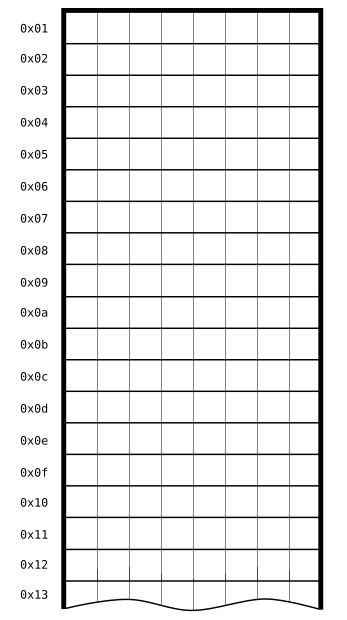
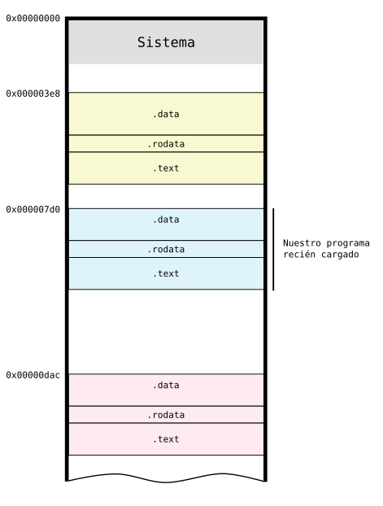
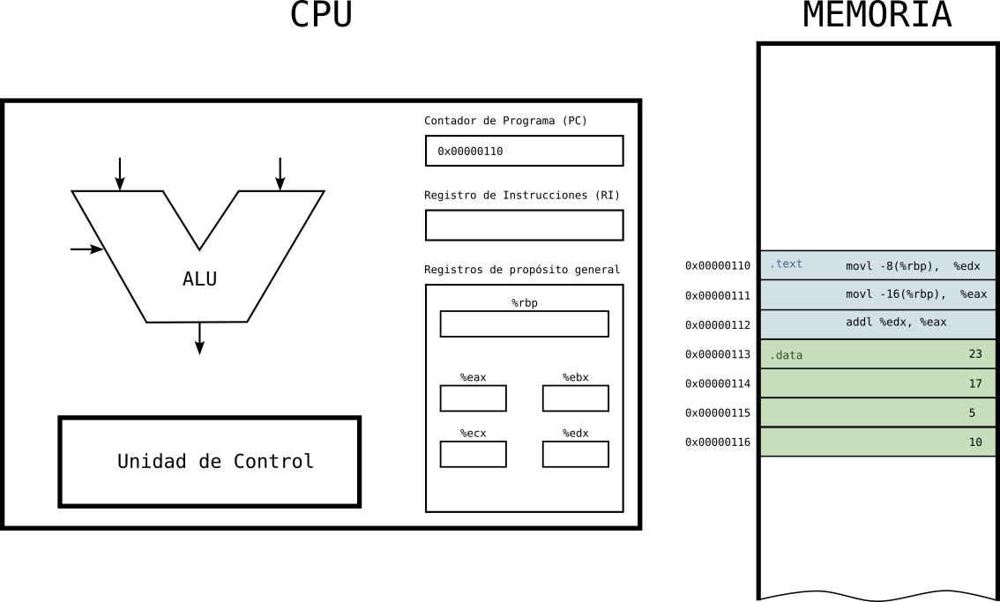
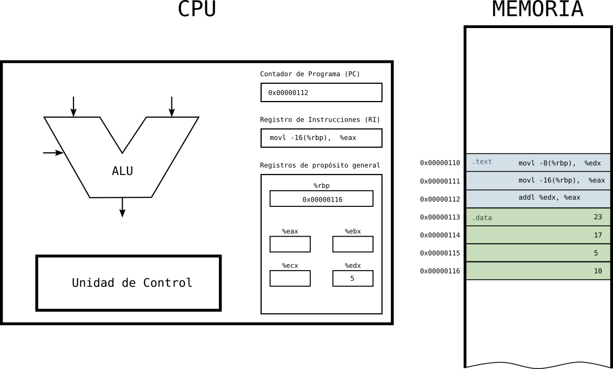
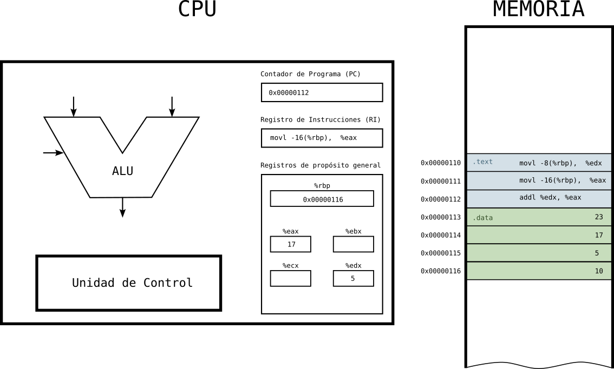
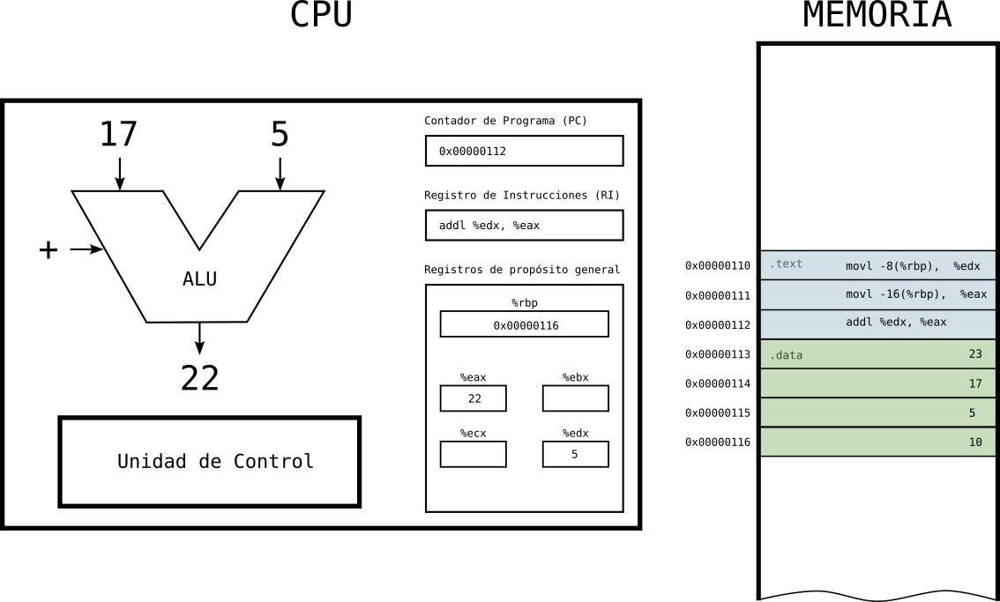

# Resultados de aprendizaje y criterios de evaluación

- **RA1** Reconoce los elementos y herramientas que intervienen en el desarrollo de un programa informático, analizando sus características y las fases en las que actúan hasta llegar a su puesta en funcionamiento.
  - **CE1a** Se ha reconocido la relación de los programas con los componentes del sistema informático: memoria, procesador, periféricos, entre otros.

# Ejecución de un programa en un ordenador

Vamos a ver en este apartado cómo se ejecuta un programa, ya traducido a código máquina, en la Arquitectura von Neumann, de manera que acabemos de entender la función de cada una de las partes de dicha arquitectura y cómo se relaciona y funcionan conjuntamente el software y el hardware.

Necesitas tener presente la arquitectura de von Neumann para entender todo lo que te voy a explicar en este apartado:


## Carga del programa en memoria

Antes, vamos a recordar cómo es una memoria, a nivel físico, en la Arquitectura von Neumann. En la imagen tienes representada una memoria con estas características:

- **Arquitectura de 8 bytes**: registros de la CPU de 8 bits y filas de la memoria RAM de 8 bits (cada una de las celdas es un bit).
- Las direcciones son de las filas de la memoria y están dadas en hexadecimal (los número comienzan con el prefijo **0x** para indicar que dicho número está en formato hexadecimal).
- Se trata, pues, de una **memoria de 256 bytes**, es decir, hay **2 048 celdas o bits**.



Cuando ejecutas un programa (abres un programa) el sistema operativo se encarga de cargarlo en la memoria principal. Como, en dicha memoria, pudiera haber más programas porque, hoy en día, se pueden estar ejecutando varios programas al mismo tiempo en un mismo ordenador, el sistema operativo utiliza una serie de algoritmos para buscar un lugar donde cargar el nuevo programa a ejecutar.

Este podría ser el estado en que se encuentra la memoria con el nuevo programa cargado. Como ves en la imagen, cada programa cargado en memoria se divide en varias secciones que, por simplificar, he reducido en tres:

- Los datos de solo lectura **.rodata** donde están los valores constantes que no cambian durante la ejecución del programa. Esta memoria es fija y conocida en tiempo de ejecucion.
- La sección con los datos **.data**, espacio reservado para almacenar datos que varía a lo largo de la ejecución del programa. A estos datos se les denomina variables. Esta memoria varía a lo largo de la ejecución del programa. Habrá momentos que ocupe más y momentos en los que ocupe menos.
- Y, por último, la sección donde se encuentran las instrucciones traducidas a lenguaje máquina. A esta sección se le conoce comúnmente como **.text**. El tamaño de esta sección es fija y conocida en tiempo de ejecución.



Como vemos en la imagen teníamos 2 programas ejecutándose en memoria: uno en la dirección **0x3e8** y otro en la dirección **0xdac**. El sistema operativo decidió cargar nuestro programa en la dirección **0x7d0**. Además, fíjate que las primeras direcciones de memoria son las que se utilizan para el sistema operativo que es el programa que se carga durante el arranque del ordenador.

Cuando se cierra una programa, el sistema operativo liberará su espacio en memoria para que lo pueda ocupar otro programa en ejecución.

> Aunque está fuera del alcance de esta unidad, los programas en ejecución, una vez cargados en la memoria, se conocen como **procesos**. Quédate con este nombre porque será importante en otros momentos.

## Ejecución de un programa

Una vez cargado el programa en memoria se puede pasar a su ejecución.

> La manera en que el sistema operativo gestiona todos los programas en ejecución queda fuera del alcance de este módulo, lo estudiarás en otros módulos. Así pues, vamos a suponer que solo tiene que ejecutar nuestro programa.

Los programas son **secuencias de instrucciones que se ejecutan en orden**, una detrás de otra. A veces se rompe esta secuencia con instrucciones de salto que hacen que el programa, de repente, vaya atrás o adelante, permitiendo bucles y llamadas a rutinas. Una vez acabado el salto, el bucle o la llamada a una rutina, se vuelve a la secuencia de instrucciones.

Esta **ejecución se hace dentro de la CPU**, para lo cual se tienen que ir cargando las instrucciones en el **registro de instrucciones (RI)** del microprocesador de una en una. Estas instrucciones viaja de la memoria la CPU. Qué instrucciones es la siguiente se sabe porque la CPU mantienen la dirección de memoria de la siguiente instrucción a ejecutar en el **registro contador de programa (PC)**.

Vamos a imaginar un programa muy sencillo que consta de estas tres instrucciones en ensamblador:

```asm
movl    -8(%rbp), %edx
movl    -16(%rbp), %eax
addl    %edx, %eax
```

Aunque no es importante para conocer el funcionamiento de la ejecución de un programa en la CPU, sí te puedo decir que este programa suma dos números que hay en memoria.

Usamos las instrucciones en ensamblador en vez de en código máquina para que resulte más fácil de entender y porque, al mismo tiempo, es lo más cercano a la máquina.

**Estado 1: programa cargado en memoria**

- La CPU tiene en su registro **PC** la dirección de la primera instrucción a ejecutar.
- En la memoria tenemos las instrucciones en la sección **.text** y los datos a sumar en la sección **.data**.



**Estado 2: primera instrucción en al CPU**

- La CPU tiene en el **RI** la instrucción a ejecutar y en el **PC** la dirección de la siguiente instrucción a ejecutar.


**Estado 3: primera instrucción ejecutada**

- Una vez ejecuta la primera instrucción, tenemos en el registro **edx** el dato que había en memoria.


**Estado 4: segunda instrucción en la CPU**

- La CPU tiene en el **RI** la segunda instrucción a ejecutar y en el **PC** la dirección de la siguiente instrucción a ejecutar.



**Estado 5: segunda instrucción ejecutada**

- Una vez ejecuta la segunda instrucción, tenemos en el registro **eax** el dato que había en memoria.



**Estado 6: tercera instrucción en la CPU**

- La CPU tiene en el **RI** la tercera y última instrucción a ejecutar y en el **PC** la dirección de la siguiente instrucción a ejecutar (no hay más, así que terminaremos aquí).


**Estado 7: tercera instrucción ejecutada**

- Una vez ejecuta la tercera instrucción, tenemos en el registro **eax** el resultado de sumar lo que había en **edx** y en el propio **eax**.
- Para la ejecución de esta instrucción, al ser una suma, se ha hecho uso de la **ALU**. Recuerda que la **ALU** hace las operaciones matemáticas y lógicas.


