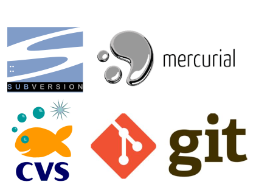
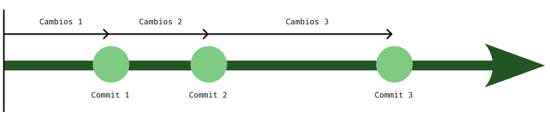
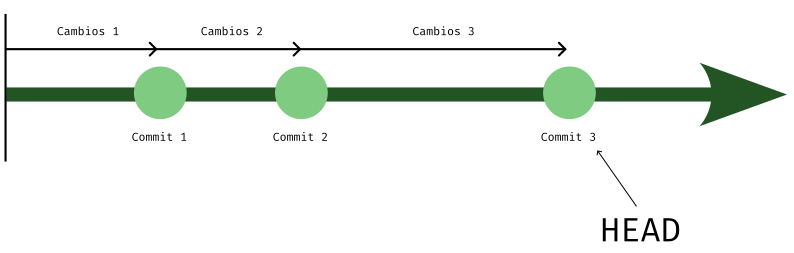
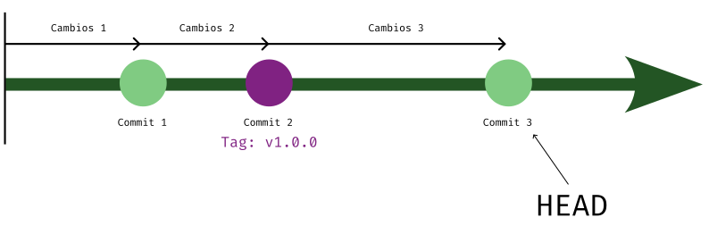
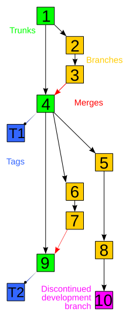

# Resultados de aprendizaje y criterios de evaluación

- **RA4** Optimiza código empleando las herramientas disponibles en el entorno de desarrollo
  - **CE4f** Se ha realizado el control de versiones integrado en el entorno de desarrollo.

# Control de versiones

El software está sometido a continuos cambios y, en general, suele tener una vida muy larga durante la cual hay que seguir manteniendo dicho software: añadir nuevas funcionalidades, modificar otras o corregir *bugs* que van apareciendo.

Es por ese motivo que los desarrolladores de software publican recurrentemente nuevas versiones y, es conveniente, por no decir imprescindible, que se mantenga de alguna manera el historial de cambios que se van haciendo durante la vida del software.

Es aquí donde surgen los **sistemas de control de versiones**.

El **control de versiones** es la prácticas de la Ingeniería del Software de control, organización y seguimiento de diferentes versiones en la historia de los ficheros de un proyecto, principalmente ficheros con código fuente pero, en general, se puede hacer de cualquier tipo de fichero.

# Sistema de control de versiones

Un **sistemas de control de versiones** es una herramienta software para **automatizar el control de versiones**.

Existen muchas herramientas de control de versiones pero, hoy en día, tenemos una herramienta que domina sobre todas las demás: **Git**. No obstante existen otros sistemas como, por ejemplo: **Subversion**, **Mercurial** o **cvs**.

En cualquier caso, toda herramienta de control de versiones debe proporcionar:

- Mecanismo de almacenamiento de los elementos que deba gestionar (por ejemplo: ficheros de texto, imágenes, documentación...)
- Posibilidad de realizar cambios sobre los elementos almacenados (por ejemplo: modificaciones parciales, añadir, borrar, renombrar o mover elementos).
- Registro histórico de las acciones realizadas con cada elemento o conjunto de elementos (normalmente pudiendo volver o extraer un estado anterior del producto).
- Generación de informes con los cambios introducidos entre dos versiones en los que poder ver los ficheros involucrados y otra información.

# Terminología

La terminología utilizada puede variar entre diferentes sistemas de gestión de versiones pero hay una serie de términos generales que se hace necesario conocer independientemente de la herramienta a usar.

## Repositorio

El **repositorio** es el lugar en el que se almacenan los datos actualizados e históricos de cambios. Este repositorio es gestionado por el sistema gestor de versiones y, nosotros, como de desarolladores, solo podemos indicar a dicho sistema gestor de versiones qué queremos hacer sobre ese repositorio mediante órdenes o comandos.

Si el repositorio está centralizado en un servidor se le suele conocer como **repositorio remoto**. En estos casos, los desarrolladores se descargan dicho repositorio remoto en local (en su ordenador) y van actualizando su copia local con el remoto. Esta es la base del desarrollo colaborativo a través de sistemas de control de versiones.

## Cambio

Cuando en el contexto de los sistemas de gestión de versiones hablamos de cambio nos referimos a:

- Uno o varios ficheros

Y a todo tipo de acciones:

- Fichero/s creado/s
- Fichero/s borrado/s
- Fichero/s modificado/s

## Revisión o versión

Una **revisión** es un versión determinada de la información que se gestiona. Hay sistemas que identifican las revisiones con un contador (por ejemplo Subversion) y otros sistemas que identifican cada una de las versiones mediante un *hash* como puede ser *SHA1* (por ejemplo Git).

> No confundir versión en este contexto con versión de software.

Es el desarrollador quien decide cuándo se realizará una versión con todos los ambios realizados.

## Commit

Es un término muy utilizado porque es el nombre técnico que se le da al **conjunto de cambios que forman una revisión o versión**.

Así pues, un desarrollador realiza cambios en los ficheros de un repositorio. En algún momento decide crear una revisión o versión con todos esos cambios. A esa revisión o versión con los cambios lo denominamos **commit**.

Gráficamente, podemos representar a estos *commits* como puntos con los cambios introducidos a lo largo del tiempo.

## HEAD

A la última versión se le suele identificar de forma especial con el nombre **HEAD**. Así, en la representación anterior, el *HEAD* sería el *commit 3*:

## Tag y release

Con los **tag** consigues marcar, rotular o señalar, una versión concreta en el histórico de cambios del control de versiones, destacándola por alguna razón. Esto hace que se puedan identificar de forma fácil revisiones importantes del proyecto.

Se suelen destacar con estos **tag** los puntos en que se liberan nuevas versiones del software (*release*), de ahí que los términos **tag** y **release** estén relacionados.

En el ejemplo gráfico anterior, hemos rotulado o añadido un *tag* al *commit 2* creando la *release* a la que se la ha asignado el nombre "v1.0.0":

## Línea base, *baseline* o *trunk*

Todos los proyectos bajo el control de un sistema de gestión de versiones tienen una línea base o *baseline* en la que se mantienen todas las revisiones aprobadas. A esta línea base también se la conoce como *trunk*.

Esta es la línea o punto de referencia para comenzar con nuevos cambios.

Los nuevos cambios se suelen hacer en las denominadas ramas o *branch* que vemos en el siguiente apartado.

## Rama o *branch*

Como ya adelantaba en el término anterior, los cambios nuevos en el software se hacen en una línea separada del **baseline**. A estas líneas separadas se las conoce como **branch**. En estos *branch* puedes hacer todo tipo de cambios sin miedo a perder nada ni estropear nada.

Si los cambios son estables y han sido probados y aprobados pueden pasar al *baseline* a través de lo que se conoce como **merge** o mezcla. Es decir, se mezcla la rama en la que estás trabajando con el *baseline*.

En un sistema de gestión de versiones veremos el histórico de cambios como si de un árbol se tratara, de ahí que usemos el término *branch* en este contexto.

Esta imagen representa los cambios de un software a través de un control de versiones (imagen obtenida en la [Wikipedia](https://en.wikipedia.org/wiki/File:Revision_controlled_project_visualization-2010-24-02.svg)):

## Rama principal

Es un sinónimo de *baseline*. En un sistema de gestión de versiones en la que se trabaja con ramas, a la línea principal o *baseline* se le denomina como **rama principal**.

En los repositorios remotos esta rama principal suele estar protegida y solo los administradores y usuarios con permisos pueden escribir en ella, pueden mezclar otras ramas en ella.

Así pues, si eres un desrrollador sin permisos para escribir en la rama principal tienes que solicitar que tus cambios sean aprobados y mezclados en dicha rama principal.

## Conflicto

Los conflictos están a la orden del día en repositorio remotos en los que varios desarrolladores trabajan.

Ya sabes, a estas alturas, que el desarrollo de software es un trabajo colaborativo donde varios programadores trabajan en diferentes partes. Esto hace que, a menudo, varios programadores de un mismo proyecto mezclen cambios en la rama principal que lleve a conflictos.

Estos conflictos se dan, principalment, porque dos desarrolladores han hecho cambios en el mismo fichero y en la misma línea.

Los conflictos se resuelven, básicamente, decidiendo qué cambio va a quedar y qué otro no.

## Blame

Todos los cambios son identificados de alguna manera como ya comenté más arriba y, junto a este identificador, también queda marcado la informción del desarrollador que hizo dicho cambio.

Al autor de un cambio se le denomina **blame**.

Es importante saber qué desarrollador ha hecho un cambio, no para culparle de nada, sino porque dicho desarrollador será la persona apropiada para solventar un error relacionado con su *commit* o para hacer modificacios sobre dicho *commit*.