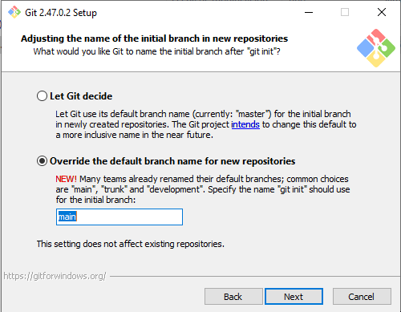
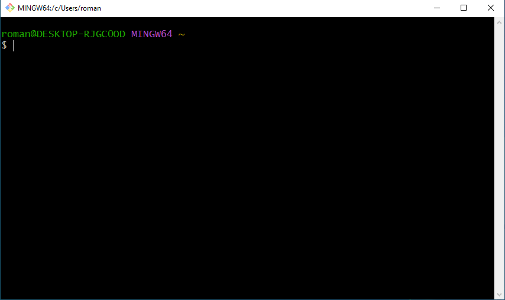

# Resultados de aprendizaje y criterios de evaluación

- **RA4** Optimiza código empleando las herramientas disponibles en el entorno de desarrollo
  - **CE4f** Se ha realizado el control de versiones integrado en el entorno de desarrollo.

# Git: primeros pasos

## ¿Qué es Git?

**Git** es un software de control de versiones diseñado por **Linus Torvalds** cuyo propósito general es llevar registro de los cambios en ficheros incluyendo coordinar el trabajo que varias personas realizan sobre ficheros compartidos en un repositorio de código.

> Linus Torvalds es el creador del kernel Linux tan popular hoy en día. Creó Git para gestionar las versiones de Linux.


La **web oficial de Git** es [https://git-scm.com](https://git-scm.com). Aquí tienes una fantástica y completísima documentación y todo lo que necesites, incluyendo un libro gratuito online llamado **Pro Git**.

## Instalación

Te explico en los siguientes apartados cómo instalar Git en la distribución de GNU/Linux llamada Debian (sería igual en Ubuntu o Lliurex, por ejemplo) y cómo hacerlo en Windows.

### Instalar Git en Debian

La forma más sencilla y directa de instalar Git en distribuciones "tipo" Debian sería desde la termina, con un usuario con permisos de administración:

```shell
$ sudo apt install git
```

No estaría de más que, antes de instalar Git, actualizaras el sistema con estos dos comandos:

```shell
$ sudo apt update
$ sudo apt upgrade
```

Git es un programa de la terminal que se llama `git` y tiene multitud de opciones como veremos pronto. Así pues, para usar Git hay que abrir la terminal y usar el comando `git`.

### Instalar Git en Windows

Desde la página web oficial de Git puedes **[descargar el instalador de Git](https://git-scm.com/downloads/win)** para Windows.

Cuando ejecutes el instalador, ejecútalo y al llegar a este paso elige la opción que ves en la siguiente captura eligiendo **main** como rama por defecto:



Todo lo demás lo puedes dejar como venga por defecto. En cualquier caso, no te preocupes, porque todo puede ser re-configurado.

El programa instalado para poder usar Git se llama **Git Bash** y cuando lo abras verás que no es más que una terminal:



## Configuración

Git es un programa de la terminal, como ya te he comentado, aunque existen *front-end* para trabajar con él de manera gráfica. De hecho, más adelante, veremos cómo usarlo de forma integrada en los editores de código.

Antes de poder usar Git para la gestión de los repositorios es necesario configurar algunas opciones obligatorias. Abre la terminal y ejecuta estos comandos para:

- Configurar Git para que sepa el nombre del desarrollador (cambia mi nombre por el tuyo):

```bash
$ git config --global user.name "Román Martínez"
```

- Configurar Git para especificar el e-mail del desarrollador (cambia mi e-mail por el tuyo):

```bash
$ git config --global user.email "rg.martinezferrand@edu.gva.es"
```

- Configurar el nombre que tendrá la rama principal. En Git vamos a usar siempre como nombre de la rama principal **main**, así que ejecuta este comando tal cual:

```bash
$ git config --global init.defaultBranch main
```

- Por último, necesitas configurar el editor de textos que Git usará cuando lo necesites (lo entenderás más adelante). Yo voy a poner aquí "emacs" que es mi editor de textos favoritos, el que yo uso. Por tanto, busca qué editor de textos tienes instalado, cómo se llama y cambia ese valor de "emacs" por el tuyo.

```bash
$ git config --global core.editor emacs
```

> En Windows, si no lo tienes claro, usa como editor **notepad** o **notepad.exe**.

### Ver la configuración de tu instalación de Git

Para terminar este apartado. Si quieres ver la configuración actual de Git en tu sistema ejecuta este comando:

```shell
$ git config --list
```

Verás algo así:

```shell
[roman@t480 ~]$ git config --list
user.email=rg.martinezferrand@edu.gva.es
user.name=Román Martínez
core.editor=emacs
init.defaultbranch=main
```