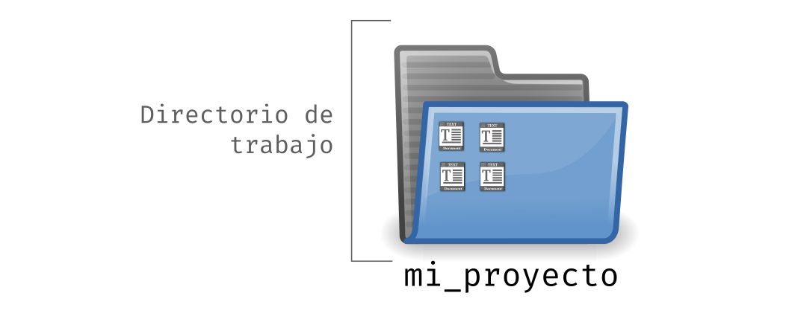
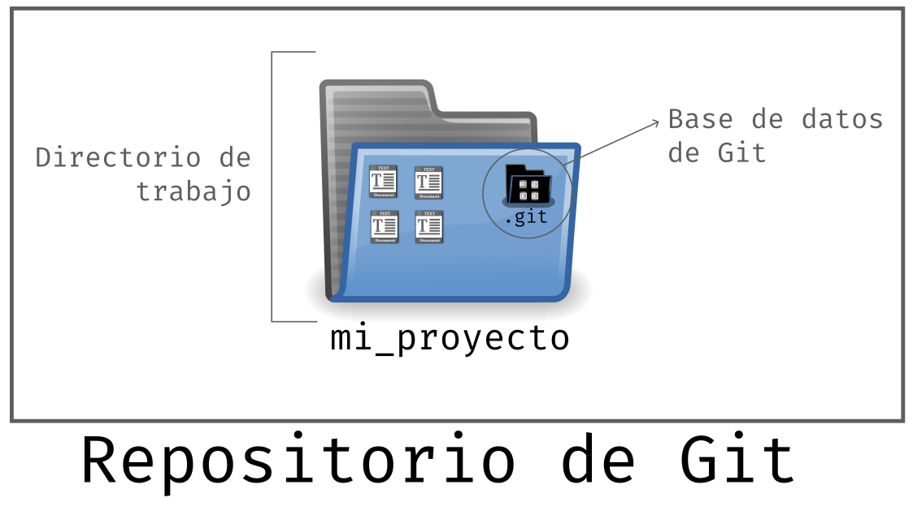

# Resultados de aprendizaje y criterios de evaluación

- **RA4** Optimiza código empleando las herramientas disponibles en el entorno de desarrollo
  - **CE4f** Se ha realizado el control de versiones integrado en el entorno de desarrollo.

# Git: conceptos

## Directorio de trabajo

Un **directorio de trabajo** (o **working directory** en inglés), es una carpeta que contiene los ficheros, y otras carpetas, del proyecto sobre el que estás trabajando. En nuestro caso será un proyecto de software.

Imagina que tenemos un proyecto llamado `mi_proyecto`. Esto significa que, en algún lugar de nuestro disco, tenemos una carpeta llamada `mi_proyecto`. Pues bien, el directorio de trabajo es dicha carpeta.



Otro concepto que tienes que interiorizar es el de **raíz del proyecto**, **carpeta raíz** o **directorio raíz**, que es, precisamente, ese **directorio de trabajo**.

Imagina que tenemos la siguiente estructura dentro de `mi_proyecto`:

```shell
mi_proyecto/
├── AUTHORS
├── clear
├── LICENSE
├── README.md
└── src
    ├── java
    │   ├── Main.java
    │   └── OtherClass.java
    └── resources
        └── icon.png
```

- `mi_proyecto` es el directorio de trabajo que contiene todo lo demás.
- `mi_proyecto` es la carpeta raíz.
- `mi_proyecto/src/java` es una subcarpeta dentro de `src` y, a su vez, dentro de `mi_proyecto`.

Así pues, si te dan la instrucción de entrar a la raíz del proyecto, tendrás que situarte, entrar en la carpeta `mi_proyecto`. Si en vez de entrar a `mi_proyecto` entras a `mi_proyecto/src`, entonces no estarás en la raíz del proyecto.


## Repositorio de Git

Un repositorio de Git es un **directorio de trabajo en el que se ha inicializado Git y se encuentra en la raíz del proyecto la carpeta `.git`**. En esta carpet `.git` es donde está la base de datos de Git, es decir, donde Git guarda toda la información que necesita para la gestión del repositorio.

El siguiente proyecto sería un repositorio a su vez porque, como ves, en la carpeta raíz se tiene la carpeta oculta `.git`:

```shell
mi_proyecto/
├── .git
├── AUTHORS
├── clear
├── LICENSE
├── README.md
└── src
    ├── java
    │   ├── Main.java
    │   └── OtherClass.java
    └── resources
        └── icon.png
```

La siguiente imagen representa un repositorio de Git:



Por último, **Git hace un seguimiento de los ficheros que hay en el directorio de trabajo**.
