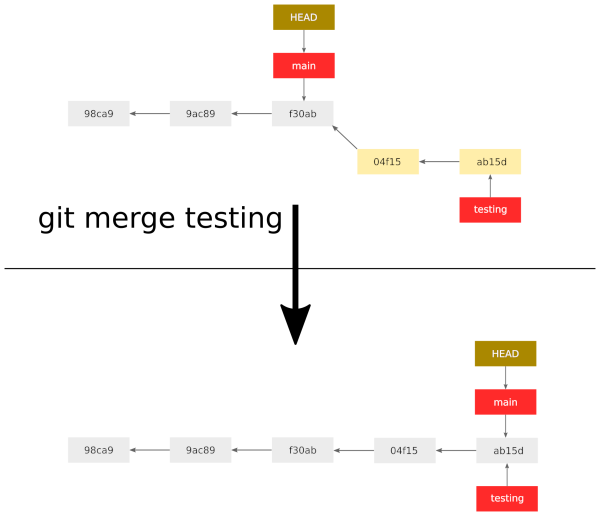
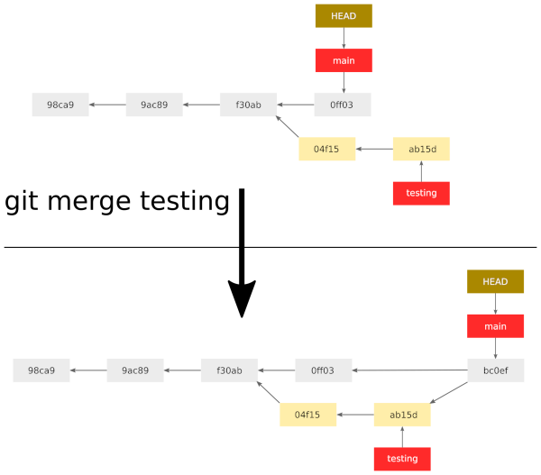
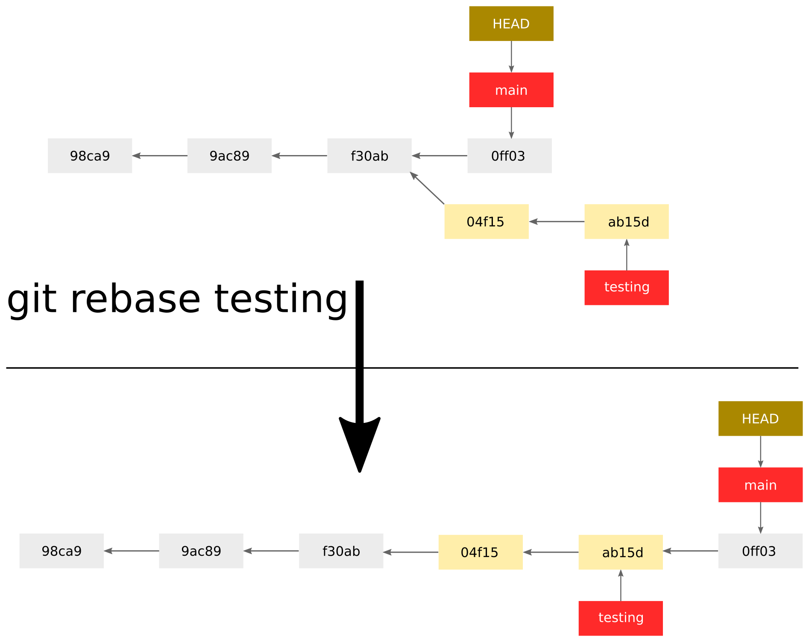
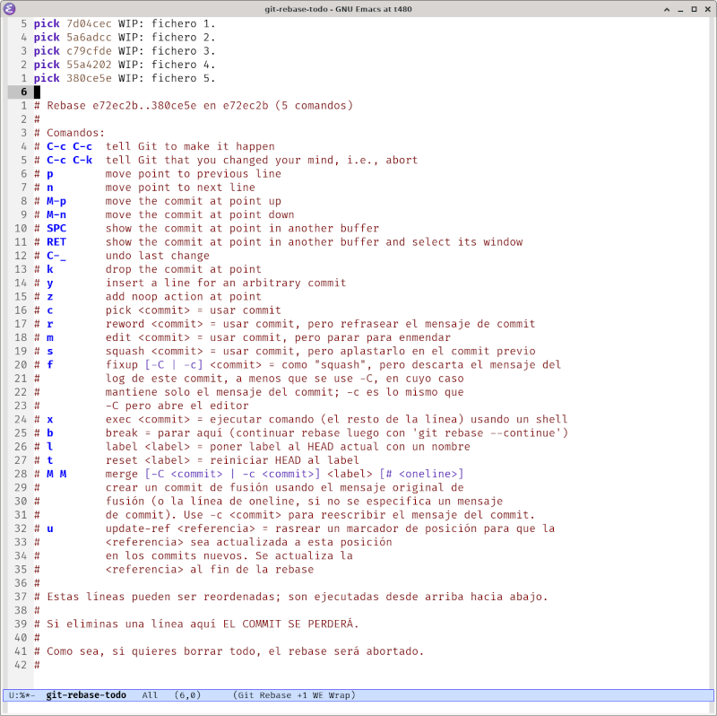

# Resultados de aprendizaje y criterios de evaluación

- **RA4** Optimiza código empleando las herramientas disponibles en el entorno de desarrollo
  - **CE4f** Se ha realizado el control de versiones integrado en el entorno de desarrollo.

# Git: trabajo en local

Antes de empezar debes tener muy claro que **Git** hace el **seguimiento de ficheros, no de carpetas**.

Ahora sí, te explico brevemente los comandos básicos para poder trabajar con repositorios locales de Git.

## Inicializar un repositorio de Git

Para inicializar un repositorio de Git, muévete al directorio de trabajo y ejecuta el siguiente comando:

```shell
$ git init
```

A partir de ahora Git hará un seguimiento de los cambios que se produzcan en el directorio de trabajo, que ahora es un repositorio.

## Estado de un repositorio

Si quieres ver el estado del repositorio ejecuta el comando:

```shell
$ git status
```

Este comando te informará del estado en que se encuentran los ficheros del repositorio. Además, este comando es fundamental y muy útil porque, en función del estado te informa, además, de los comandos y opciones que puedes usar.

Estas son las posibilidades con las que te pudes encontrar:

- El repositorio está **limpio**: no hay cambios.
- Hay ficheros **sin seguimiento**: estos ficheros están en el directorio de trabajo pero Git no sabe nada de ellos, no están en el repositorio.
- Hay cambios **no rastreados**: hay cambios en los ficheros que se indique, lo que significa que estos ficheros están en Git pero han sufrido cambios en el directorio de trabajo.
- Cambios en el **área de preparación o stage**: son ficheros que has marcado para que se añadan en el siguiente *commit*.

## Confirmar cambios (add y commit)

Sea cual sea el escenario del cambio, si los quieres confirmar en Git tienes que llevar a cabo **2 pasos**: 

1. `git add` 
2. `git commit`

En el `git add` tienes que indicar los cambios que deseas introducir en el **stage** o **área de preparación**. Por ejemplo, `git add fic1.txt fic2.txt` añadaría al **stage** los cambios en esos dos ficheros. Si quieres añadir todos los ficheros con cambios puedes usar el atajo `git add .` (fíjate en el último punto).

Tras añadir los cambios en el **stage** ya puedes llevar a cabo el segundo paso: `git commit`. Este comando tiene que ir acomapañdo de una descripción, por ejemplo: `git commit -m "Nuevos ficheros añadidos al repositorio"`.

## Ver el historial de commits

Para ver el historial de los cambios o *commits* que has hecho usa el comando:

```shell
$ git log
```

Este comando tiene un serie de opciones para ver más o menos información. Algunos ejemplos son:

- `git log --graph` para ver el grafo con el camino de los cambios en el repositorio.
- `git log --oneline` para ver los *commits* junto a la descripción, nada más.
- `git log --stat` para ver qué ficheros fueron cambiados y cuántos cambios se han producido.
- `git log --p` para ver los detalles de los cambios en los ficheros.
- `git log --all` para ver el árbol completo con los commits de todas las ramas que se hayan podido crear y existan.

Puedes combinar opciones. Por ejemplo: para ver el resumen en una línea de todos los commits en forma de árbol o grafo, puedes usar esta combinación de opciones:

```shell
$ git log --oneline --graph --all
```

Otra opción que nos ofrece Git es la de ver estos logs formateados de tal manera que podamos usar dicha información para liberar una nueva versión de nuestro software:

```shell
$ git shortlog
```

## Ver las diferencias entre commits: diff

Si quieres ver las diferencias que hay entre dos *commits* puede usar el comando siguiente:

```shell
$ git diff
```

Existen varias posibilidades y opciones. Te resumo algunas de ellas:

- `git diff` para ver los cambios antes de realizar el *commit*, es decir, para ver los cambios que hay actualmente en el directorio de trabajo.
- `git diff <hash commit a> <hash commit b>` para ver los cambios entre los *commits* indicados (para especificar estos commits se tienen que usar los códigos hash que verás en el `git log`).
- `git diff --name-only <hash commit a> <hash commit b>` para ver solo los nombres de los ficheros que han sufrido cambios entre los dos commits indicados.

> En el [siguiente apartado](./06_git_diff_interpretacion.md) se explica la interpretación de la salida de este comando.

## HEAD y referencias relativas a commits

El commit sobre el que estamos trabajando tiene un puntero llamado `HEAD`.

Podemos usar el puntero o referencia `HEAD` de Git para identificar *commits*. En vez de usar el hash del *commit* podemos usar el `HEAD`:

- `HEAD` apunta al último commit.
- `HEAD^` apunta al penúltimo commit.
- `HEAD^^` apunta a dos commits atrás.
- `HEAD^^^` apunta a tres commits atrás... vas entendiendo, ¿verdad?

Si quieres apuntar a muchos commits atrás o, si lo prefires, puedes usar esta otra alternativa:

- `HEAD~1` apunta la penúltimo commit.
- `HEAD~2` apunta a dos commits atrás.
- `HEAD~10` apunta a diez commits atrás.

Sabiendo esto, podemos comprar los últimos dos commits así:

```shell
$ git diff HEAD^ HEAD
```

O, podemos ver los cambios que se han producido en los últimos tres commits así:

```shell
$ git diff HEAD~3 HEAD
```

## Ignorar ficheros: .gitignore

Podemos indicar a Git qué ficheros queremos que ignore y, por tanto, que no haga un seguimiento de ellos.

Se utiliza un fichero llamado `.gitignore` que se crea en la raíz del proyecto para indicar en él, a través de reglas, qué ficheros queremos ignorar. ¿Por qué? Entre otras cosas:

- Porque contienen información sensible
- Porque son ficheros temporales
- Porque no son relevantes para el proyecto

En este fichero indicamos, por cada línea, qué fichero o ficheros ignorar, usando patrones. Algunos ejemplos:

- `message.log` ignorará todos aquellos ficheros que se llamen `message.log` estén donde estén.
- `/message.log` ignorará el fichero llamado `message.log` que está en la raíz del proyecto.
- `logs/message.log` ignorará el fichero llamado `message.log` que está dentro de la carpeta `logs`.
- `logs/` ignorará todos los ficheros que haya en la carpeta `logs`.
- `*.log` ignorará todos los ficheros que acaben con la extensión `.log`, estén donde estén.
- `logs/*.txt` ignorará todos los ficheros que acaben con `.txt` dentro de la carpeta `logs`.

## Ramas (branches)

Recuerda configurar tu rama principal con el nombre **main** que es el nombre que se usa como convención hoy en día para la rama principal de trabajo:

```bash
$ git config --global init.defaultBranch main
```

Recordada esta configuración, ya podemos hablar de ramas: **las ramas son diferentes líneas de desarrollo en Git**. Nos permite trabajar de forma independiente y sin colisionar en proyectos colaborativos.

También es útil usar ramas aunque trabajemos en un proyecto en solitario porque esto nos permitirá trabajar en características nuevas y hacer pruebas sin estropear la línea principal de trabajo.

Aquí te doy la lista de las opciones, lo que puedes hacer con las ramas y el comando `git branch`:

- `git branch` para ver las ramas actuales.
- `git branch <nombre de la rama>` para crear una nueva rama con el nombre indicado.
- `git branch -d <nombre de la rama>` para borrar de forma **segura** un rama ya que no se hará si hay cambios por mezclar.
- `git branch -D <nombre de la rama>` para borrar la rama, se encuentre como se encuentre (¡¡¡CUIDADO!!!).
- `git branch -m <nuevo nombre de la rama>` para cambiar el nombre de la rama actual por el nuevo nombre indicado.
- `git branch -a` para ver las ramas remotas (todavía no hemos entrado al trabajo remoto con Git pero podemos adelantar este comando, para que lo tengas presente).

## Checkout: moverse a otra rama o commit

La opción `checkout` de Git la podemos usar para movernos de rama o de commit.

### Moverse a otra rama

Te puedes mover de una rama a otra con el comando `git checkout` indicando el nombre de la nueva rama. Imagina que estás en la rama *main* y quieres moverte a la rama *ejemplo*:

```bash
$ git checkout ejemplo
```

Los cambios que no hayan sido *commiteados* se arrastran.

Un opción muy útil es la de crear la rama y moverse a ella. Lo que haríamos en dos comandos:

```bash
$ git branch ejemplo
$ git checkout ejemplo
```

Lo puedes hacer en uno, con la opción *-b* de *checkout*:

```bash
$ git checkout -b ejemplo
```

### Moverse a otro commit

¿Para qué podemos querer hacer esto? Para ver el estado de los ficheros y del proyecto en un commit atrás en el tiempo. Para moverte:

```bash
$ git checkout <hash del commit al que te quieres mover>
```

En este punto, el puntero `HEAD` quedará *detacheado* (*detached HEAD state*) lo que significa que no estás en ninguna rama. Así que, cualquier cambio que hagas en esta situación quedará huérfano.

Para volver al último commit, imaginando que estás en la rama *main*, basta con hacer:

```bash
$ git checkout main
```

## Mezclar ramas

Puedes mezclar ramas haciendo un *merge* o un *rebase*. Te resumo en los siguientes apartados cómo hacerlo.

### Merge

Para mezclar un rama en otra tienes que situarte en el destino, en la rama donde se hará la mezcla. Por ejemplo, si quieres mezclar una rama llamada **rama1** en la rama principal **main** tienes que realizar estos pasos:

1. Cambia a la rama **main** si no estás ya en ella: `git checkout main`.
2. Ejecuta el comando siguiente para mezclar lo que hay en **rama1**: `git merge rama1`.

Cuando mezclas con un *merge* Git puede hacer esta mezcla o fusión de dos maneras:

- Mezcla por **avance rápido** o **fast-forward** si no ha habido cambios en la rama destino desde la bifurcación.



- Mezcla por **tres vías** en la que Git creará un commit adicional para unir el camino de las dos ramas a fusionar.



Además, cuando mezclas dos ramas se pueden producir colisiones o conflictos si en ambas ramas se ha modificado el mismo fichero en la misma línea. Veremos, más adelante, cómo se resuelven estos conflictos ya que, si esto sucede, tendrás que terminar la fusión a mano.

### Rebase

La idea es la misma que con el *merge*: vas a la rama donde quieres fusionar y fusionas la rama origen.

La diferencia es que le *rebase* crea un histórico lineal, llevando los *commits* del origen al final de los *commits* del destino. Así pues, como contrapartida, pierdes la "historia real" de lo que sucedió y cómo sucedió.



En los *rebase* también se pueden producir conflictos que habría que resolver a mano para terminar de fusionar las dos ramas.

Para hacer el *rebase* de un rama **rama1** a **main** tienes que realizar estos pasos:

1. Cambia a la rama **main** si no estás ya en ella: `git checkout main`.
2. Ejecuta el comando siguiente para mezclar lo que hay en **rama1**: `git rebase rama1`.

### Información de ramas fusionadas y no fusionadas

Por último, es conveniente saber si una rama ha sido o no fusionadas, así como otra información que puede resultar interesante. Estos comandos te ayudarán a ello:

- Para ver la última confirmación de cambios en cada rama: `git branch -v`
- Para saber las ramas que ya han sido fusionadas: `git branch --merged`
- Para saber las ramas que no han sido fusionadas todavía: `git branch --no-merged`

## Rebase interactivo

Un rebase interactivo te permite reorganizar y editar el historial de commits de manera flexible y controlada. Por ejemplo, con un rebase interactio puedes:

- Reordenar commits: puedes cambiar el orden en que se aplicaron los commits.
- Aplastar commits: puedes combinar varios commits en uno solo.
- Dividir commits: puedes dividir un commit en varios commits más pequeños.
- Editar commits: puedes editar el mensaje de commit o incluso el contenido del commit.
- Eliminar commits: puedes eliminar commits que ya no sean necesarios.
- Reorganizar commits para que tengan un orden lógico y coherente.

Para dar comienzo a un commit interactivo tienes que ejecutar el comando `git commit -i <commit>` donde `<commit>` es la referencia del commit a partir del cual das comienzo al rebase interactivo. Por ejemplo:

```shell
$ git rebase -i HEAD~5
```

Das comienzo al commit interactivo a partir del commit `HEAD~5` (este no se incluye).

Al iniciar un commit interactivo se abrirá el editor de textos y aparecen la referencia a todos los commits junto a un comentario con todas las opciones disponibles.

Aquí puedes ver la captura del editor de textos que muestra información de un rebase interactivo:


