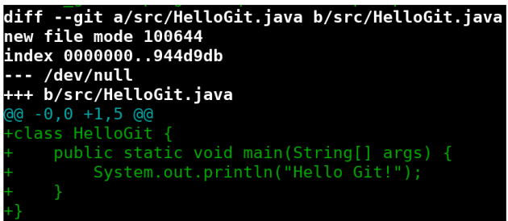
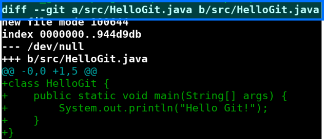
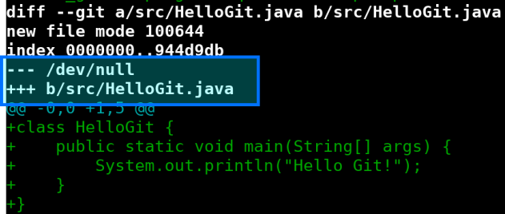
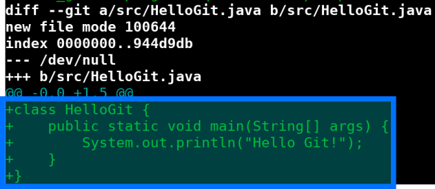
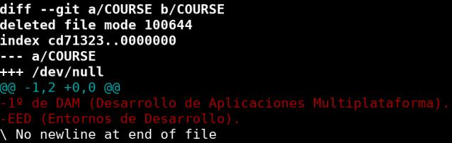
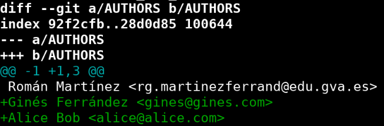
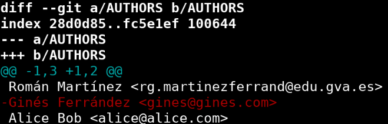
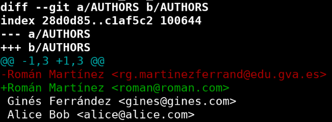
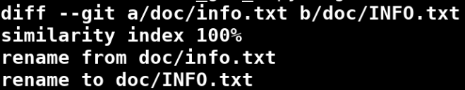

# Resultados de aprendizaje y criterios de evaluación

- **RA4** Optimiza código empleando las herramientas disponibles en el entorno de desarrollo
  - **CE4f** Se ha realizado el control de versiones integrado en el entorno de desarrollo.

# Git: análisis de un git diff

Te explico en los siguientes apartados cómo analizar la salida del comando `git diff` para saber qué ha pasado entre dos *commits* o revisiones.

## Ficheros nuevos en el repositorio

En la siguiente imagen puedes ver cómo, el comando `git diff`, indica que un nuevo fichero ha sido añadadio al repositorio.



Vamos a analizar la salida poco a poco. En la primera línea puedes ver cómo Git nos indica que la información es sobre el fichero **src/HelloGit.java** de una forma un tanto especial. Como ves se añade el prefijo **a/** en la primera referencia y el prefijo **b/** en la segunda referencia: `diff --git a/src/HelloGit.java b/src/HelloGit.java`.

Esto lo vamos a encontrar en todas las salidas del comando `git diff`, ya que si hay cambios en un fichero significa que hay dos versiones: la **a** (cómo estaba antes de los cambios) y la **b** (cómo queda tras los cambios).



En las dos siguientes líneas que destaco debajo, vemos que la versión **a** es destacada con tres guiones: `---`, mientras que la versión **b** es destacada con tres "mases": `+++`. Esto, de nuevo, los vamos a encontrar en todas las salidas del comando `git diff`.

La novedad aquí, es que en la versión **a** encontramos `/dev/null` y en la version **b** encontramos `b/src/HelloGit.java`. Esto significa que el fichero en cuestión no existía y, por tanto, se ha añadido en el nuevo commit.



Por último, tenemos los cambios en sí. Como ves en la captura de debajo se han añadido 5 líneas al fichero. Dicho de otro modo, se ha creado un nuevo fichero con 5 líneas:



## Ficheros eliminados del repositorio

Veamos cómo indica Git en un `git diff` que un fichero estaba en el repositorio y se eliminó:



Fíjate como el `/dev/null` está ahora en la versión **b**, lo que significa que estaba en el repositorio y ha dejado de estar (se ha eliminado). El fichero que se ha eliminado es `COURSE`. Y se han eliminado dos líneas, como ves en la parta de abajo.

## Ficheros con líneas añadidas

En la siguiente captura puedes ver cómo se han añadido nuevas líneas al fichero `AUTHORS`. Vemos como no tenemos en ninguna versión la referencia a `/dev/null` lo que significa que dicho fichero está en ambas versiones, **a** y **b**.



La (nueva) versión **b** tiene dos nuevas líneas, a saber:

```text
Ginés Ferrández <gines@gines.com>
Alice Bob <alice@alice.com>
```

## Fichero con líneas eliminadas

Cuando se eliminan líneas verás cómo la salida de `git diff` te muestra cómo la versión **a** perdió dichas líneas. En este ejemplo, se ha eliminado la línea: `Ginés Ferrández <gines@gines.com>`:



## Fichero con líneas modificadas

Si lo que ha sucedido es que se han modificado líneas verás cómo `git diff` te muestra dos acciones: línea eliminada y línea añadida. Así pues, modificar una línea se puede ver cómo borrarla y volverla a crear.

Aquí, se ha modificado una línea:

- En la versión **a** se tenía `Román Martínez <rg.martinezferrand@edu.gva.es>`
- En la (nueva) versión **b** se tiene `Román Martínez <roman@roman.com>`



## Fichero renombrado

Si cambias el nombre, y por tanto la ruta relativa, de un fichero, `git diff` te muestra la descripción de dicho cambios como ves en esta captura donde se renombró `doc/info.txt` por `doc/INFO.txt`:


