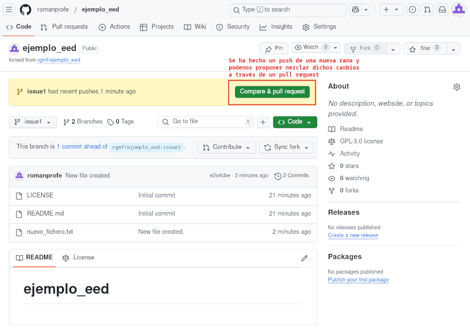
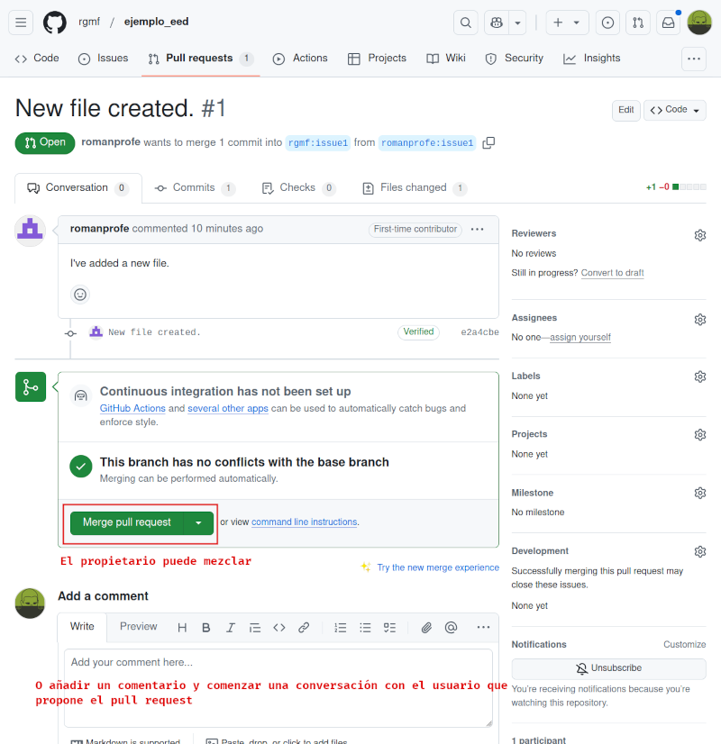

# Resultados de aprendizaje y criterios de evaluación

- **RA4** Optimiza código empleando las herramientas disponibles en el entorno de desarrollo
  - **CE4f** Se ha realizado el control de versiones integrado en el entorno de desarrollo.

# GitHub

A los repositorios de GitHub puedes acceder por medio de dos protocolos: **HTTPS** y **SSH**.

Los repositorios tienen una serie de permisos y te puedes encontrar con varias situaciones:

- El repositorio es tuyo: puedes escribir (**push**) y leer (**clone** y **pull**) de él sin restricciones.

- El repositorio no es tuyo y es público: puedes leer (**clone** y **pull**) pero no puedes escribir en él (**push**).

- El repositorio no es tuyo y es privado: no puedes acceder a él de ninguna manera a menos que te hayan añadido como colaborador.

## Diferencias entre remoto por HTTPS y SSH

Cuando clones un repositorio o añadas un remoto de GitHub tienes dos opciones:

- Hacerlo por **HTTPS**, en cuyo caso la dirección del repositorio será como esta: https://github.com/rgmf/eed.git
- Hacerlo por **SSH**, en cuyo caso la dirección del repositorio será como esta: git@github.com:rgmf/eed.git

Si lo haces por **HTTPS** y realices una acción que requiera de autenticación tendrás que introducir tu usuario y contraseña de GitHub.

si lo haces por **SSH** y realices una acción que requiera de autenticación se hará automáticamente siempre y cuando tengas configuradas las claves SSH. ¿Cómo? Te lo explico en el siguiente apartado.

## Configurar claves SSH

Tras crear una cuenta, lo primero que deberías hacer es configurar claves SSH para autenticarte e identificarte cada vez que hagas operaciones que necesiten de autenticación.

Las instrucciones de cómo hacerlo las puedes encontra en la propia página web de GitHub:

- [Conectar a GitHub con SSH](https://docs.github.com/es/authentication/connecting-to-github-with-ssh)
- [Generar una clave SSH](https://docs.github.com/es/authentication/connecting-to-github-with-ssh/generating-a-new-ssh-key-and-adding-it-to-the-ssh-agent#generating-a-new-ssh-key)

## Participar en un proyecto: fork y pull request

Si quieres o necesitas colaborar en un proyecto en GitHub tienes que realizar estos pasos en este orden:

1. En la página de GitHub del proyecto en el que quieres participar verás un botón de **Fork**. Si haces clic en dicho botón se creará una copia de dicho proyecto en tu cuenta: el **fork**. Este *fork* es tuyo y tienes permisos totales sobre el mismo.

2. En tu *fork* puedes hacer cambios y todo lo que quieras.

3. Cuando tengas cambios que quieras proponer para ser incorporados al repositorio original tendrás que subir dichos cambios a tu *fork* en un rama y hacer clic en el botón **Compare & pull request**.

4. El *pull request* lo verá el propietario del repositorio original, quien decidirá si lo mezcla en el repositorio original o no. Además, desde ese *pull request* se puede entablar una conversación.

5. El propietario del repositorio original decide si mezclar o no los cambios propuestos en los pull request que recibe.

